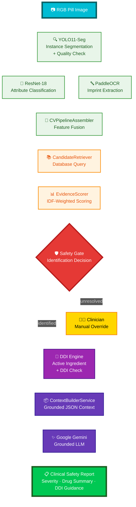

<div align="center">

# 💊 Pill Safety AI

### Multiple Pill Recognition & Interaction Safety Platform

Identify multi-pill medications, evaluate Drug-Drug Interactions (DDI), and generate grounded clinical safety reports using **Computer Vision (YOLO11-Seg + ResNet-18 + PaddleOCR)**, **IDF-weighted RAG**, and **Google Gemini**.

<p>


</p>

</div>

---

# 📖 Overview

Polypharmacy presents significant clinical risks when multiple medications are combined in daily organizers. Visual identification of mixed or dropped pills is error-prone, and unintended co-administration of interacting drugs can cause severe adverse drug events (ADEs).

**Pill Safety AI** is an AI-powered clinical decision support platform designed to identify loose medications from a single image and detect adverse drug-drug interactions:

- **Decoupled Vision Pipeline**: Combines class-agnostic instance segmentation with multi-attribute classification and imprint OCR to scale seamlessly across large pharmaceutical catalogs.
- **IDF-Weighted RAG Matching**: Ranks candidate formulations against a structured drug database using statistical rarity weighting.
- **Grounded Clinical Reports**: Resolves active ingredients, evaluates pairwise DDI severity, and generates zero-hallucination medical advisories via Google Gemini.

> **Medical Disclaimer:**  
> This platform supports medication identification and safety review. It does **not replace** professional medical advice, diagnosis, or prescribing decisions from a qualified healthcare provider.

---

# ⭐ Highlights

- **Decoupled Vision Architecture**: Class-agnostic YOLO11-Seg segmentation paired with ResNet-18 attribute recognition and PaddleOCR text extraction.
- **IDF-Weighted Evidence Scoring**: Statistically balances imprint, shape, and color traits to reliably identify formulations.
- **Clinical Safety Gate**: Enforces confidence thresholds and hard reject rules with a manual clinician override fallback.
- **Deterministic DDI Engine**: Cross-checks active molecules pairwise across 5 severity tiers with duplicate ingredient alerts.
- **Hallucination-Free Reporting**: Synthesizes verified clinical context into clear natural language reports using Google Gemini.
- **Dual UI Workspace**: Features a full desktop clinical review suite and an iPhone 17 Pro Max mobile simulator in Streamlit.

---

# ✨ Features

## 💊 Computer Vision Pipeline
- **Instance Segmentation**: Class-agnostic YOLO11-Seg extracts pill masks and checks image quality (blur and glare).
- **Attribute Classification**: Multi-head ResNet-18 identifies shape, color, dosage form, scoreline, and logo markers.
- **Imprint OCR**: PaddleOCR reads and normalizes alphanumeric imprints across pill faces.

---

## 🧠 IDF-Weighted RAG Identification
- **Statistical Retrieval**: Uses Inverse Document Frequency (IDF) to weight rare visual features over common ones.
- **Safety Decisioning**: Flags detections as `identified`, `unresolved`, or `out_of_scope` to prevent false positives.
- **Clinician Override**: Enables manual binding for damaged or ambiguous pills via API.

---

## ⚡ Drug-Drug Interaction (DDI) Engine
- **Ingredient Mapping**: Translates identified medications into active chemical entities.
- **Severity Classification**: Evaluates pairwise interactions (`contraindicated`, `major`, `moderate`, `minor`, `none`).
- **Duplicate Alerts**: Warns against co-administering multiple pills sharing the same active molecule.

---

## 📋 Grounded LLM Reporting
- **Bounded Context**: Restricts LLM generation strictly to database-verified drug and interaction facts.
- **Actionable Summaries**: Formats medical advisories with clear severity alert banners in Vietnamese.

---

# 🏗️ Architecture


---

# ⚙️ Technology Stack

| Component | Technology | Purpose |
|---|---|---|
| **Runtime** | Python 3.11+ | Core platform runtime |
| **Web UI** | Streamlit 1.40–1.42 | Desktop clinical suite & mobile simulator |
| **Backend API** | FastAPI 0.115.6 / Uvicorn | High-performance REST API services |
| **Computer Vision** | PyTorch 2.2–2.6 / Ultralytics YOLO11-Seg | Neural network segmentation & instance detection |
| **Attribute Classification** | ResNet-18 | Pill shape, color, dosage form, scoreline & logo classification |
| **OCR & Vision Utils** | PaddleOCR 3.0.3 / OpenCV 4.10.0 | Imprint text extraction & image quality checks |
| **Database & ORM** | PostgreSQL 16 / SQLAlchemy 2.0 / Alembic | Relational medication database & migrations |
| **LLM Reasoning** | Google Gemini API / Pydantic 2.9.2 | Grounded clinical report synthesis & schema validation |
| **Infrastructure** | Docker Compose | Containerized PostgreSQL database management |
---

# 📸 Application Preview

> Screenshots will be added in a future revision.

---

# 🚀 Getting Started

### 1. Prerequisites
- Python `3.11+`
- Docker and Docker Compose
- Google Gemini API Key *(optional, for LLM report generation)*

---

### 2. Installation & Configuration

```bash
# Clone the repository
git clone <repository_url>
cd Multiple-Pill-Recognition-And-Interaction-Safety

# Create and activate virtual environment
python -m venv .venv
source .venv/bin/activate  # On Windows: .venv\Scripts\activate

# Install dependencies and configure environment
pip install -r requirements.txt
cp .env.example .env
```

---

### 3. Database Setup

```bash
# Start PostgreSQL via Docker Compose
docker compose up -d postgres

# Apply migrations and seed standard drug datasets
alembic upgrade head
python -m pill_safety.database.scripts.seed
```

> **Note:** Set `DATABASE_URL=sqlite:///pill_safety.db` in `.env` to run with a local SQLite database without Docker.

---

### 4. Running the Application

```bash
# Launch Streamlit Clinical Workspace (Port 8501)
streamlit run app.py

# Launch FastAPI Backend Service (Port 8000)
uvicorn pill_safety.api.main:app --reload
```

---

# 📂 Project Structure

```text
.
├── app.py                      # Streamlit application entrypoint (Desktop & Mobile)
├── compose.yaml                # Docker Compose definition for PostgreSQL 16
├── requirements.txt            # Pinned project dependencies
├── .env.example                # Environment variables template
├── configs/                    # Training and inference configurations
├── data/                       # Datasets, splits, and benchmark test sets
├── database_seed/              # Standard drug, appearance, and DDI seed JSONs
├── docs/                       # Architectural specifications and evaluation protocols
├── experiments/                # Training run checkpoints, metrics, and plots
├── models/                     # Trained model weights (YOLO11-seg, ResNet-18, PaddleOCR)
├── scripts/                    # Benchmark, smoke test, and tuning utilities
├── src/
│   └── pill_safety/            # Core application package
│       ├── api/                # FastAPI application routes (`main.py`)
│       ├── core/               # Configuration settings and environment loader
│       ├── cv/                 # Computer vision subsystem (seg, attr, ocr, pipeline)
│       ├── database/           # SQLAlchemy models, session factory, repositories
│       ├── rag/                # RAG retrieval, ranking, DDI lookup, and reporting
│       └── schemas/            # Pydantic data validation contracts
├── tests/                      # Automated test suite (cv, database, rag, ui)
└── ui/                         # Streamlit UI views, components, and styles
```

---

# 🔥 Production Engineering Features

- [x] **Decoupled Vision-Reasoning Architecture** — Prevents combinatorial retraining explosion when expanding the drug catalog.
- [x] **Strict Pydantic Contract Validation** — End-to-end type validation across all CV, RAG, and API boundaries.
- [x] **IDF Statistical Evidence Scoring** — Dynamically balances feature weights to eliminate bias toward common shapes and colors.
- [x] **Pre- & Post-Retrieval Safety Gates** — Intercepts low-confidence or conflicting pill predictions before reporting.
- [x] **Zero-Hallucination Guardrails** — Constrains LLM synthesis strictly to database-verified active ingredients and DDI pairs.
- [x] **Graceful Fallback Handling** — Dual SQLite/PostgreSQL support and offline deterministic rule-based report fallbacks.

---

# 🗺️ Roadmap
chưa có
> Future improvements will be documented here.

---

# 🎯 Learning Objectives

- **Decoupled AI System Design**: Architecting hybrid systems combining computer vision models with statistical RAG and LLMs.
- **Multi-Task Deep Learning**: Training and deploying multi-head classification networks (ResNet-18) alongside instance segmenters (YOLO11-Seg).
- **Statistical Evidence Retrieval**: Implementing inverse document frequency (IDF) weighting for robust entity matching.
- **Clinical AI Safety Engineering**: Enforcing hard rejection gates and zero-hallucination prompt strategies in healthcare.
- **Production API & Database Lifecycle**: Developing modular FastAPI services with Pydantic v2 validation, SQLAlchemy ORM, and Alembic migrations.

---

# 🤝 Contributing

Contributions, bug reports, and suggestions are welcome.

Before submitting a pull request:

- Follow the existing project structure and coding conventions.
- Add or update tests when changing functionality.
- Ensure all tests pass successfully.

---

# 📄 License

Chưa có

---

## 👨‍💻 Author

**Hehehee Team**

Developed as a final project for *HCMUT EE Machine Learning & IoT Lab — Summer Courses 2026.*

<p align="center">
  <a href="https://github.com/GOx9-P">
    
  </a>
  &nbsp;&nbsp;&nbsp;
  <a href="https://github.com/TNTruong196">
    
  </a>
  &nbsp;&nbsp;&nbsp;
  <a href="https://github.com/giabaots12">
    
  </a>
  &nbsp;&nbsp;&nbsp;
  <a href="https://github.com/nguyenbaoquoc">
    
  </a>
  &nbsp;&nbsp;&nbsp;
  <a href="https://avatars.githubusercontent.com/qnhi206">
    
  </a>
</p>


