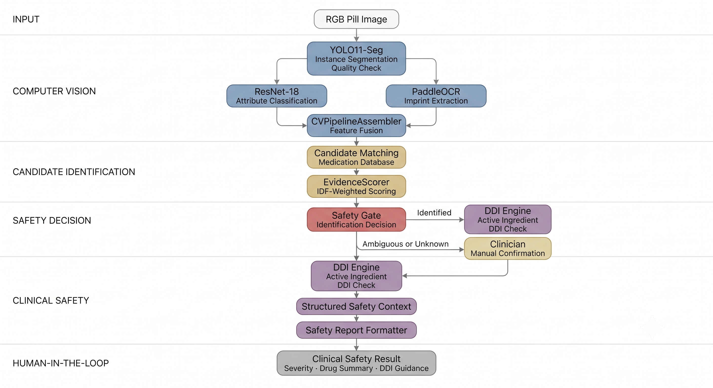

<div align="center">

# 💊 Pill Safety AI

### Multiple Pill Recognition & Interaction Safety Platform

Identify multiple loose pills from one image and evaluate Drug-Drug Interactions (DDI) using **Computer Vision (YOLO11-Seg + ResNet-18 + PaddleOCR)**, IDF-weighted candidate matching, and a medication database.

<p>


</p>

</div>

---

# 📖 Overview

Polypharmacy presents significant clinical risks when multiple medications are combined in daily organizers. Visual identification of mixed or dropped pills is error-prone, and unintended co-administration of interacting drugs can cause adverse drug events (ADEs).

**Pill Safety AI** is a clinical decision-support project for identifying loose medications from a single image and reviewing known adverse drug-drug interactions:

- **Decoupled Vision Pipeline**: Class-agnostic instance segmentation, attribute classification, and imprint OCR extract evidence for each pill.
- **Evidence-Based Identification**: Candidate products are matched against the medication database using imprint similarity and IDF-weighted visual attributes.
- **Safety Review**: Accepted products are mapped to active ingredients, then checked pairwise for recorded DDI severity and duplicate ingredients.

> **Medical Disclaimer:**
> This platform supports medication identification and safety review. It does **not replace** professional medical advice, diagnosis, or prescribing decisions from a qualified healthcare provider.

---

# ⭐ Highlights

- **Decoupled Vision Architecture**: Class-agnostic YOLO11-Seg segmentation paired with ResNet-18 attribute recognition and PaddleOCR text extraction.
- **IDF-Weighted Evidence Scoring**: Balances imprint, shape, dosage form, and color evidence when ranking candidate formulations.
- **Clinical Safety Gate**: Applies confidence thresholds and hard-reject rules, with a manual confirmation path for ambiguous pills.
- **Deterministic DDI Engine**: Cross-checks active molecules pairwise across `contraindicated`, `major`, `moderate`, `minor`, and `none` severity levels, including duplicate-ingredient alerts.
- **Structured Safety Results**: Keeps identified medications, unresolved pills, interactions, sources, and scope warnings in validated data contracts.
- **Dual UI Workspace**: Provides a desktop clinical workspace and an iPhone 17 Pro Max Streamlit preview.

---

# ✨ Features

## 💊 Computer Vision Pipeline
- **Instance Segmentation**: YOLO11-Seg extracts pill masks and evaluates image quality, including blur, glare, and lighting checks.
- **Attribute Classification**: ResNet-18 predicts pill shape and color from per-pill crops.
- **Imprint OCR**: PaddleOCR extracts and normalizes alphanumeric imprints; scoreline processing can split readings from pill sides.

---

## 🧠 IDF-Weighted Medication Identification
- **Candidate Matching**: Searches active medication appearances by imprint first, then falls back to dosage form, shape, and color attributes.
- **Evidence Scoring**: Uses Inverse Document Frequency (IDF) weights so rare visual attributes contribute more strongly to ranking.
- **Safety Decisioning**: Labels detections as `identified`, `ambiguous`, `unknown`, or `insufficient_visual_evidence` and recommends recapture or manual confirmation when needed.

---

## ⚡ Drug-Drug Interaction (DDI) Engine
- **Ingredient Mapping**: Resolves identified drug products to active chemical entities stored in the database.
- **Severity Classification**: Evaluates recorded pairwise interactions as `contraindicated`, `major`, `moderate`, `minor`, or `none`.
- **Duplicate Alerts**: Flags products that share an active ingredient.

---

## 📋 Clinical Safety Results
- **Structured Context**: Combines identified products, unresolved pills, interaction records, duplicate warnings, source references, and scope warnings.
- **Deterministic Formatting**: Produces a safety summary from the verified identification and interaction data.

---

# 🏗️ Architecture

<p align="center">
  
</p>

---

# ⚙️ Technology Stack

| Component | Technology | Purpose |
|---|---|---|
| **Runtime** | Python 3.11+ | Core platform runtime |
| **Web UI** | Streamlit 1.40–1.42 | Desktop clinical workspace and mobile preview |
| **Backend API** | FastAPI 0.115.6 / Uvicorn | REST API services for medication and interaction data |
| **Computer Vision** | PyTorch 2.2–2.6 / Ultralytics YOLO11-Seg | Pill instance segmentation and mask generation |
| **Attribute Classification** | ResNet-18 | Pill shape and color classification |
| **OCR & Vision Utils** | PaddleOCR 3.0.3 / OpenCV 4.10.0 | Imprint extraction and image-quality processing |
| **Identification & Safety Logic** | IDF-weighted scoring / RapidFuzz | Candidate ranking, safety decisions, and fuzzy imprint matching |
| **Database & ORM** | PostgreSQL 16 or SQLite / SQLAlchemy 2.0 / Alembic | Medication, appearance, ingredient, and interaction data |
| **Infrastructure** | Docker Compose | Containerized PostgreSQL database management |
---

# 📸 Application Preview

## 💻 Desktop Version

<p align="center">
  
</p>

<p align="center">
  
</p>

<p align="center">
  
</p>

<p align="center">
  
</p>

<p align="center">
  
</p>

## 📱 Mobile Version

<p align="center">

  

  

  

  

</p>

---

# 🚀 Getting Started

### 1. Prerequisites
- Python `3.11+`
- Docker and Docker Compose *(optional when using the local SQLite configuration)*

---

### 2. Installation & Configuration

```bash
# Clone the repository
git clone <repository_url>
cd Multiple-Pill-Recognition-And-Interaction-Safety

# Create and activate virtual environment
python -m venv .venv
source .venv/bin/activate  # On Windows PowerShell: .venv\Scripts\Activate.ps1

# Install dependencies and configure environment
pip install -r requirements.txt
cp .env.example .env
```

Set `DATABASE_URL` in `.env` for the database you intend to use. The supplied example is configured for the Docker PostgreSQL service; uncomment the SQLite option for a local database file.

---

### 3. Database Setup

```bash
# Start PostgreSQL via Docker Compose
docker compose up -d postgres

# Apply migrations and seed the medication datasets
$env:PYTHONPATH = "src"  # PowerShell
alembic upgrade head
python -m pill_safety.database.scripts.seed
```

> **Note:** Set `DATABASE_URL=sqlite:///pill_safety.db` in `.env` to run with a local SQLite database without Docker. In PowerShell, `scripts/setup.ps1` performs the Docker, migration, and seed steps.

---

### 4. Running the Application

```bash
# Launch Streamlit Clinical Workspace (Port 8501)
streamlit run app.py

# Launch FastAPI Backend Service (Port 8000)
$env:PYTHONPATH = "src"  # PowerShell
uvicorn pill_safety.api.main:app --reload
```

---
### 5. Demo Web

#### 🔗 Resources

* **GitHub Repository:** [View Source Code](https://github.com/GOx9-P/Multiple-Pill-Recognition-And-Interaction-Safety)

#### ▶️ How to Run

1. Go to the **GitHub Repository** and open the following file:

   ```text
   merge-fe-be.ipynb
   ```

2. Copy the **file URL** of **`merge-fe-be.ipynb`** from GitHub.

3. Go to **Kaggle** and create a **new Notebook**.

4. In the Kaggle Notebook, select **Link to GitHub Repository** and paste the URL of the `merge-fe-be.ipynb` file copied in the previous step.

5. Once the Notebook has been imported successfully, click **Run All** to execute all cells.

6. When the server starts, look for the following message:

   ```text
   Your quick Tunnel has been created! Visit it at (it may take some time to be reachable):
   ```

7. Click the **link displayed directly below this message** to access the **Demo Web**.

> **Note:** The Quick Tunnel may take a short while to become accessible. If the link does not work immediately, wait a few seconds and try again.

---

# 📂 Project Structure

```text
.
├── app.py                      # Streamlit application entry point
├── alembic.ini                 # Alembic migration configuration
├── compose.yaml                # Docker Compose definition for PostgreSQL 16
├── requirements.txt            # Project dependencies
├── .env.example                # Environment-variable template
├── configs/                    # Inference and training configurations
├── data/                       # Raw, processed, augmented, benchmark, and split datasets
├── database/                   # Alembic migrations and database seed placeholder
├── database_seed/              # Medication, appearance, ingredient, DDI, and scan seed JSON files
├── docs/                       # Project, database, CV, UI, and evaluation documentation
├── experiments/                # Training checkpoints, metrics, plots, and prediction artifacts
├── inference/                  # CLI entry points for CV modules and end-to-end inference
├── models/                     # Segmentation, attribute-classification, and OCR model artifacts
├── notebooks/                  # Kaggle training and inference notebooks
├── outputs/                    # Generated crops, masks, predictions, and reports
├── scripts/                    # Setup, seeding, benchmarking, tuning, and demo utilities
├── src/
│   └── pill_safety/            # Core application package
│       ├── api/                # FastAPI application routes (`main.py`)
│       ├── core/               # Runtime configuration and environment loading
│       ├── cv/                 # Segmentation, attribute, OCR, and CV-pipeline subsystems
│       ├── database/           # SQLAlchemy models, sessions, repositories, services, and seeding
│       ├── schemas/            # Pydantic data-validation contracts
│       └── utils/              # Shared utility package
├── tests/                      # Automated tests for CV, database, UI, and safety workflow
├── training/                   # Segmentation, attribute, and OCR training workflows
└── ui/                         # Streamlit views, components, adapters, and styling
```

---

# 🔥 Production Engineering Features

- [x] **Decoupled Vision and Safety Architecture** — Keeps pill segmentation, attribute recognition, OCR, candidate matching, and DDI checks as separate components.
- [x] **Strict Pydantic Contract Validation** — Type validation across CV, identification, database, and API boundaries.
- [x] **IDF Statistical Evidence Scoring** — Dynamically weights visual attributes when ranking medication candidates.
- [x] **Pre- and Post-Matching Safety Gates** — Stops low-confidence, conflicting, merged, or non-pill predictions before an automatic identification is accepted.
- [x] **Traceable Safety Context** — Preserves the identified products, unresolved pills, interaction records, duplicate warnings, source references, and scope warnings used for the result.
- [x] **Database Flexibility** — Supports PostgreSQL through Docker Compose and a local SQLite configuration.

---

# 🎯 Learning Objectives

- **Decoupled AI System Design**: Building a modular computer-vision and medication-safety workflow.
- **Multi-Task Deep Learning**: Training and deploying ResNet-18 attribute classifiers alongside a YOLO11-Seg instance segmenter.
- **Statistical Evidence Matching**: Applying inverse document frequency (IDF) weighting to medication-candidate ranking.
- **Clinical AI Safety Engineering**: Applying rejection thresholds, manual confirmation, and scope warnings in a medication-safety workflow.
- **Production API & Database Lifecycle**: Developing modular FastAPI services with Pydantic v2 validation, SQLAlchemy ORM, and Alembic migrations.

---

# 🤝 Contributing

Contributions, bug reports, and suggestions are welcome.

Before submitting a pull request:

- Follow the existing project structure and coding conventions.
- Add or update tests when changing functionality.
- Ensure all tests pass successfully.

---

# 📄 License

This project is licensed under the [MIT License](docs/LICENSE).

---

## 👨‍💻 Author

**Hehehee Team**

Developed as a final project for *HCMUT EE Machine Learning & IoT Lab — Summer Courses 2026.*

<p align="center">
  <a href="https://github.com/GOx9-P">
    
  </a>
  &nbsp;&nbsp;
  <a href="https://github.com/TNTruong196">
    
  </a>
  &nbsp;&nbsp;
  <a href="https://github.com/giabaots12">
    
  </a>
  &nbsp;&nbsp;
  <a href="https://github.com/nguyenbaoquoc">
    
  </a>
  &nbsp;&nbsp;
  <a href="https://github.com/qnhi206">
    
  </a>
</p>
