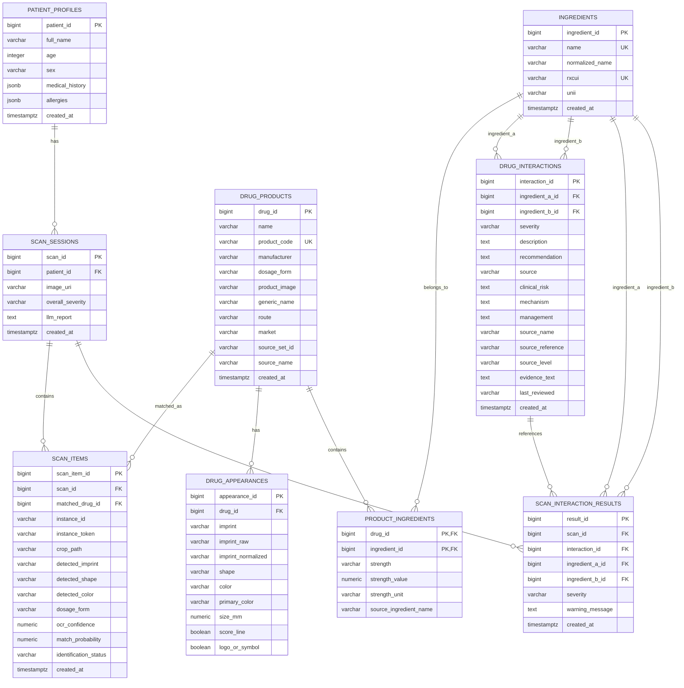

# Tài Liệu Database

Database phục vụ hệ thống nhận diện nhiều viên thuốc và kiểm tra tương tác thuốc. Dữ liệu danh mục gồm thuốc, ngoại hình, hoạt chất và tương tác theo cặp hoạt chất. Dữ liệu runtime gồm hồ sơ bệnh nhân demo, phiên scan, từng viên được nhận diện và kết quả cảnh báo theo phiên.

Dữ liệu trong `database_seed/*.json` là dữ liệu nền hoặc demo. Không lưu dữ liệu bệnh nhân thật, ảnh scan thật, token hoặc mật khẩu trong repository. Các dòng tương tác seed là dữ liệu cảnh báo có nguồn để kiểm thử hệ thống, không phải lời khuyên y tế chính thức.

## Phiên Bản Seed Hiện Tại

Tính đến ngày cập nhật `2026-08-02`, seed danh mục gồm:

| Nhóm dữ liệu | Số dòng | Ghi chú |
|---|---:|---|
| `drug_products` | 35 | 25 thuốc ban đầu + 10 thuốc bổ sung có DailyMed/RxNorm |
| `ingredients` | 35 | Hoạt chất chuẩn hóa ở mức RxNorm ingredient |
| `drug_appearances` | 35 | Mỗi product có ít nhất một visual signature |
| `product_ingredients` | 36 | Amoxicillin-clavulanate có 2 hoạt chất |
| `drug_interactions` | 141 | 16 major, 108 moderate, 17 minor từ 8 CSV công khai DDInter |

10 thuốc bổ sung gồm: atorvastatin, prednisone, hydrochlorothiazide, spironolactone, amiodarone, levofloxacin, fluoxetine, gabapentin, loratadine và propranolol.

Các cặp `Unknown` trong DDInter public CSV không được import vào `drug_interactions`, vì hệ thống chỉ nên hiển thị cảnh báo chắc chắn khi có severity xác định. Khi không tìm thấy bản ghi trong DB, UI/LLM phải nói `no known interaction in current database`, không nói là an toàn.

## Nhóm Dữ Liệu

| Nhóm | Bảng |
|---|---|
| Dữ liệu danh mục | `drug_products`, `drug_appearances`, `ingredients`, `product_ingredients`, `drug_interactions` |
| Dữ liệu runtime | `patient_profiles`, `scan_sessions`, `scan_items`, `scan_interaction_results` |

## Mô Hình ER



## Data Dictionary

### drug_products

| Cột | Kiểu | Bắt buộc | Ràng buộc | Ý nghĩa |
|---|---|---:|---|---|
| drug_id | BIGINT | Có | PK | ID nội bộ tự tăng |
| name | VARCHAR(255) | Có |  | Tên sản phẩm thuốc |
| product_code | VARCHAR(100) | Có | UNIQUE, INDEX | Khóa nghiệp vụ dùng trong JSON |
| manufacturer | VARCHAR(255) | Không |  | Nhà sản xuất |
| dosage_form | VARCHAR(100) | Không | INDEX | Dạng bào chế |
| product_image | VARCHAR(500) | Không |  | URI ảnh tham chiếu nếu có |
| generic_name | VARCHAR(255) | Không |  | Tên hoạt chất/tên gốc của sản phẩm |
| route | VARCHAR(100) | Không |  | Đường dùng, hiện seed là `ORAL` |
| market | VARCHAR(20) | Có | DEFAULT `US` | Phạm vi thị trường dữ liệu |
| product_rxcui | VARCHAR(50) | Không | INDEX | RxCUI cấp product nếu xác định được |
| source_name | VARCHAR(100) | Không |  | Nguồn chính, ví dụ `DailyMed` |
| source_reference | VARCHAR(500) | Không |  | URL nhãn/endpoint nguồn |
| source_set_id | VARCHAR(100) | Không | INDEX | DailyMed SETID |
| spl_version | VARCHAR(50) | Không |  | Version SPL nếu lấy được |
| published_date | VARCHAR(50) | Không |  | Ngày publish DailyMed |
| active | BOOLEAN | Có | DEFAULT true | Trạng thái bản ghi |
| created_at | TIMESTAMPTZ | Có | DEFAULT now() | Thời điểm tạo |
| updated_at | TIMESTAMPTZ | Có | DEFAULT now() | Thời điểm cập nhật |

### drug_appearances

| Cột | Kiểu | Bắt buộc | Ràng buộc | Ý nghĩa |
|---|---|---:|---|---|
| appearance_id | BIGINT | Có | PK | ID ngoại hình |
| drug_id | BIGINT | Có | FK, ON DELETE CASCADE, INDEX | Thuốc sở hữu ngoại hình |
| imprint | VARCHAR(100) | Có | DEFAULT '', INDEX | Ký hiệu in trên viên, chuỗi rỗng nếu chưa có |
| imprint_raw | VARCHAR(255) | Không |  | Ký hiệu gốc từ DailyMed, giữ dấu `;`, khoảng trắng nếu có |
| imprint_normalized | VARCHAR(255) | Không | INDEX | Ký hiệu chuẩn hóa cho OCR/search |
| imprint_side_a | VARCHAR(100) | Không |  | Ký hiệu mặt A nếu tách được |
| imprint_side_b | VARCHAR(100) | Không |  | Ký hiệu mặt B nếu tách được |
| shape | VARCHAR(100) | Có | DEFAULT '', INDEX | Hình dạng, chuỗi rỗng nếu chưa có |
| color | VARCHAR(100) | Có | DEFAULT '', INDEX | Màu chính, chuỗi rỗng nếu chưa có |
| primary_color | VARCHAR(100) | Không |  | Màu chính chuẩn hóa |
| secondary_color | VARCHAR(100) | Không |  | Màu phụ nếu có |
| color_pattern | VARCHAR(100) | Không |  | Kiểu phối màu nếu có |
| size_mm | NUMERIC(8,2) | Không |  | Kích thước viên |
| score_line | BOOLEAN | Có | DEFAULT false | Có vạch bẻ |
| logo_or_symbol | BOOLEAN | Có | DEFAULT false | Có logo/ký hiệu |
| coating | VARCHAR(100) | Không |  | Thông tin coating nếu có |
| source_name | VARCHAR(100) | Không |  | Nguồn ngoại hình |
| source_reference | VARCHAR(500) | Không |  | URL nhãn/endpoint nguồn |

Unique: `drug_id + imprint + shape + color`.

### ingredients

| Cột | Kiểu | Bắt buộc | Ràng buộc | Ý nghĩa |
|---|---|---:|---|---|
| ingredient_id | BIGINT | Có | PK | ID hoạt chất |
| name | VARCHAR(255) | Có | UNIQUE, INDEX | Tên hoạt chất |
| normalized_name | VARCHAR(255) | Không | INDEX | Tên hoạt chất chuẩn hóa |
| rxcui | VARCHAR(50) | Không | UNIQUE, INDEX | Mã RxNorm nếu có |
| unii | VARCHAR(50) | Không | INDEX | Mã UNII nếu có |
| source_name | VARCHAR(100) | Không |  | Nguồn chuẩn hóa, ví dụ `RxNorm` |
| source_reference | VARCHAR(500) | Không |  | URL RxNorm API |
| created_at | TIMESTAMPTZ | Có | DEFAULT now() | Thời điểm tạo |

### product_ingredients

| Cột | Kiểu | Bắt buộc | Ràng buộc | Ý nghĩa |
|---|---|---:|---|---|
| drug_id | BIGINT | Có | PK, FK, ON DELETE CASCADE | Thuốc |
| ingredient_id | BIGINT | Có | PK, FK, ON DELETE CASCADE | Hoạt chất |
| strength | VARCHAR(100) | Không |  | Hàm lượng dạng text |
| strength_value | NUMERIC(12,4) | Không |  | Hàm lượng dạng số |
| strength_unit | VARCHAR(50) | Không |  | Đơn vị như mg, mcg |
| numerator_text | VARCHAR(100) | Không |  | Biểu diễn hàm lượng gốc |
| source_ingredient_name | VARCHAR(255) | Không |  | Tên hoạt chất như ghi trong nhãn |

### drug_interactions

| Cột | Kiểu | Bắt buộc | Ràng buộc | Ý nghĩa |
|---|---|---:|---|---|
| interaction_id | BIGINT | Có | PK | ID tương tác |
| ingredient_a_id | BIGINT | Có | FK, INDEX | Hoạt chất thứ nhất |
| ingredient_b_id | BIGINT | Có | FK, INDEX | Hoạt chất thứ hai |
| severity | VARCHAR(20) | Có | CHECK | `minor`, `moderate`, `major`, `contraindicated` |
| description | TEXT | Có |  | Mô tả cảnh báo |
| recommendation | TEXT | Không |  | Khuyến nghị tham khảo |
| source | VARCHAR(255) | Không |  | Nguồn dữ liệu |
| clinical_risk | TEXT | Không |  | Mô tả rủi ro theo severity hoặc nguồn đã enrich |
| mechanism | TEXT | Không |  | Cơ chế; public DDInter CSV không có cơ chế theo cặp |
| management | TEXT | Không |  | Hướng xử trí; cần enrich trước khi hiển thị như lời khuyên cụ thể |
| alternative | TEXT | Không |  | Thuốc thay thế nếu nguồn có |
| source_name | VARCHAR(100) | Không |  | Tên nguồn chuẩn hóa |
| source_reference | VARCHAR(500) | Không |  | URL CSV/API/nhãn nguồn |
| source_level | VARCHAR(50) | Không |  | Level gốc từ DDInter |
| evidence_text | TEXT | Không |  | Evidence snapshot để RAG/LLM không tự bịa |
| last_reviewed | VARCHAR(50) | Không |  | Ngày kiểm tra nguồn |
| created_at | TIMESTAMPTZ | Có | DEFAULT now() | Thời điểm tạo |

Check: `ingredient_a_id <> ingredient_b_id`, `ingredient_a_id < ingredient_b_id`. Unique: `ingredient_a_id + ingredient_b_id`.

### patient_profiles

| Cột | Kiểu | Bắt buộc | Ràng buộc | Ý nghĩa |
|---|---|---:|---|---|
| patient_id | BIGINT | Có | PK | ID bệnh nhân nội bộ |
| full_name | VARCHAR(255) | Không |  | Tên giả/demo nếu seed |
| age | INTEGER | Không | CHECK age >= 0 | Tuổi |
| sex | VARCHAR(50) | Không |  | Giới tính |
| medical_history | JSONB | Không |  | Tiền sử bệnh |
| allergies | JSONB | Không |  | Dị ứng |
| created_at | TIMESTAMPTZ | Có | DEFAULT now() | Thời điểm tạo |

### scan_sessions, scan_items, scan_interaction_results

Các bảng runtime lưu lần scan, từng viên trong ảnh và các cảnh báo tương tác phát hiện được. Các bảng này đã có JSONB để lưu payload theo `schema (1).md`: `image_quality`, `cv_payload`, `candidate_generation`, `top_candidates`, `ranking_evidence`, `llm_context`, `llm_report_payload`, `evidence_snapshot`. File seed mặc định là `[]`; dữ liệu thật do ứng dụng tạo và không commit vào repository.

## Ánh Xạ JSON

| Bảng PostgreSQL | File seed JSON | Khóa nghiệp vụ |
|---|---|---|
| patient_profiles | patient_profiles.json | không seed mặc định |
| ingredients | ingredients.json | name |
| drug_products | drug_products.json | product_code |
| drug_appearances | drug_appearances.json | product_code + imprint + shape + color |
| product_ingredients | product_ingredients.json | product_code + ingredient_name |
| drug_interactions | drug_interactions.json | ingredient_a + ingredient_b |
| scan_sessions | scan_sessions.json | không seed mặc định |
| scan_items | scan_items.json | không seed mặc định |
| scan_interaction_results | scan_interaction_results.json | không seed mặc định |

## Mô Tả JSON

### ingredients.json

Khóa upsert: `name`.

```json
{
  "name": "acetaminophen",
  "normalized_name": "acetaminophen",
  "rxcui": "161",
  "source_name": "RxNorm",
  "source_reference": "https://rxnav.nlm.nih.gov/REST/rxcui/161/properties.json"
}
```

### drug_products.json

Khóa upsert: `product_code`.

```json
{
  "product_code": "PARA-500",
  "name": "Paracetamol 500 mg",
  "manufacturer": "Demo Pharma",
  "dosage_form": "tablet",
  "product_image": null,
  "source_name": "DailyMed",
  "source_set_id": "daily_med_set_id"
}
```

### drug_appearances.json

Khóa upsert: `product_code + imprint + shape + color`. `product_code` được seed script dùng để tìm `drug_products.drug_id`.

```json
{
  "product_code": "PARA-500",
  "imprint": "P500",
  "imprint_raw": "P 500",
  "imprint_normalized": "P500",
  "shape": "round",
  "color": "white",
  "size_mm": 10.5,
  "score_line": true,
  "logo_or_symbol": false
}
```

### product_ingredients.json

Khóa upsert: `product_code + ingredient_name`.

```json
{
  "product_code": "PARA-500",
  "ingredient_name": "Paracetamol",
  "strength": "500 mg",
  "strength_value": 500,
  "strength_unit": "mg"
}
```

### drug_interactions.json

Khóa upsert: cặp hoạt chất đã chuẩn hóa theo ID tăng dần.

```json
{
  "ingredient_a": "Aspirin",
  "ingredient_b": "Ibuprofen",
  "severity": "moderate",
  "description": "Demo interaction description.",
  "recommendation": "Consult a qualified healthcare professional.",
  "source": "Demo data only",
  "clinical_risk": "Demo risk text.",
  "source_name": "DDInter 2.0",
  "source_level": "Moderate",
  "last_reviewed": "2026-08-02"
}
```

## Thứ Tự Seed

1. `patient_profiles.json` nếu có dữ liệu giả
2. `ingredients.json`
3. `drug_products.json`
4. `drug_appearances.json`
5. `product_ingredients.json`
6. `drug_interactions.json`
7. `scan_sessions.json` nếu có
8. `scan_items.json` nếu có
9. `scan_interaction_results.json` nếu có

## Quy Tắc Cập Nhật

Thay đổi cấu trúc bảng: sửa SQLAlchemy model, tạo Alembic migration, cập nhật tài liệu này.

Thay đổi dữ liệu nền: sửa JSON trong `database_seed/`, chạy `python -m pill_safety.database.scripts.seed` với `PYTHONPATH=src`.

Dữ liệu runtime do ứng dụng tạo và không commit vào repository.

## Quy Tắc An Toàn

- Không lưu dữ liệu bệnh nhân thật.
- Không lưu token hoặc mật khẩu.
- Không coi dữ liệu interaction demo là lời khuyên y tế.
- Không diễn giải `NO_KNOWN_INTERACTION_IN_DATABASE` thành an toàn.
- Không để LLM tự tạo `mechanism`, `management` hoặc `clinical_risk` ngoài evidence đã lưu.
- Không tham chiếu bằng ID tự tăng trong JSON nếu có thể dùng khóa nghiệp vụ.
- Không chỉnh sửa migration cũ đã được dùng.
- Mọi thay đổi schema phải đồng bộ với `database_seed/db.md`.
