# MVP Architecture — Multi-Pill Recognition and Drug Interaction Warning

## 1. Objective and Safety Boundary

MVP xây dựng một hệ thống hỗ trợ nhận diện nhiều viên thuốc trong một ảnh và cảnh báo tương tác thuốc dựa trên dữ liệu có nguồn. Hệ thống được chia thành hai module lớn:

1. **Computer Vision Module (CV)**  
   Nhận ảnh đầu vào, phát hiện từng viên thuốc, tách mask/crop và trích xuất metadata thị giác: `shape`, `color`, `dosage_form`, `scoreline`, `imprint`, confidence và quality flags.

2. **Retrieval/RAG Module**  
   Nhận metadata từ CV, truy xuất ứng viên thuốc trong database có cấu trúc, xếp hạng candidate, chuẩn hóa hoạt chất, tra cứu tương tác thuốc và dùng LLM để trình bày báo cáo có căn cứ.

Ranh giới trách nhiệm:

```text
CV Module
    → Chỉ mô tả viên thuốc nhìn thấy như thế nào.

Retrieval/RAG Module
    → Dùng metadata thị giác để truy xuất thuốc có thể tương ứng,
      kiểm chứng candidate, lấy dữ liệu dược học và tạo báo cáo.
```

Nguyên tắc an toàn:

- CV không tự kết luận tên thuốc.
- LLM không tự đoán tên thuốc từ kiến thức nền.
- Việc định danh thuốc phải qua structured retrieval, không qua suy luận tự do.
- Hệ thống không buộc phải nhận diện mọi viên thuốc.
- Khi bằng chứng không đủ, trả `ambiguous`, `unknown`, `insufficient_visual_evidence` hoặc yêu cầu ảnh bổ sung.
- Chỉ thuốc `identified` mới được dùng cho kết luận DDI chắc chắn.
- Không tìm thấy DDI trong database không đồng nghĩa phối hợp thuốc an toàn.
- Kết quả chỉ có tính hỗ trợ, không thay thế bác sĩ hoặc dược sĩ.

Phạm vi MVP:

- Input chính là một ảnh RGB chứa một hoặc nhiều viên thuốc/viên nang đường uống.
- Ảnh có thể có ánh sáng không ổn định, viên tiếp xúc hoặc chồng lấp một phần.
- Người dùng có thể cung cấp thêm ảnh mặt còn lại, ảnh cận cảnh, country/market hoặc danh sách thuốc đang dùng.
- MVP chưa đảm bảo bao phủ mọi thuốc lưu hành toàn cầu.

---

## 2. System Architecture

```mermaid
%%{init: {
  "theme": "base",
  "flowchart": {
    "curve": "stepAfter",
    "htmlLabels": true,
    "nodeSpacing": 32,
    "rankSpacing": 48,
    "padding": 12
  },
  "themeVariables": {
    "fontFamily": "Arial, Helvetica, sans-serif",
    "fontSize": "13px",
    "primaryColor": "#FFFFFF",
    "primaryTextColor": "#111111",
    "primaryBorderColor": "#2F2F2F",
    "lineColor": "#2F2F2F",
    "secondaryColor": "#F5F5F5",
    "tertiaryColor": "#FAFAFA",
    "clusterBkg": "#FFFFFF",
    "clusterBorder": "#4A4A4A"
  }
}}%%

flowchart TB

    %% =========================================================
    %% GIAO DIỆN ĐẦU VÀO
    %% =========================================================


    %% =========================================================
    %% MODULE A — THỊ GIÁC MÁY TÍNH
    %% =========================================================
    subgraph CV["MODULE A — THỊ GIÁC MÁY TÍNH"]
        direction TB


        %% -----------------------------------------------------
        %% A1. ĐÁNH GIÁ CHẤT LƯỢNG ẢNH
        %% -----------------------------------------------------
        subgraph CV1["A1. Đánh giá chất lượng ảnh đầu vào"]
            direction LR

            IQ1["Đánh giá độ mờ<br/>và độ nét"]

            IQ2["Đánh giá ánh sáng<br/>thiếu sáng hoặc cháy sáng"]

            IQ3["Phát hiện phản sáng<br/>và vùng lóe sáng"]

            IQ4["Kiểm tra độ phân giải<br/>và kích thước viên trong ảnh"]

            IQG{"Chất lượng ảnh<br/>có đạt yêu cầu không?"}

            IQ1 --> IQG
            IQ2 --> IQG
            IQ3 --> IQG
            IQ4 --> IQG
        end


        %% -----------------------------------------------------
        %% A2. PHÁT HIỆN VÀ PHÂN VÙNG VIÊN THUỐC
        %% -----------------------------------------------------
        subgraph CV2["A2. Phát hiện và phân vùng từng viên thuốc"]
            direction TB

            SEG1["<b>YOLOv11-Seg</b><br/>Phân vùng không phụ thuộc loại thuốc<br/>Viên thuốc và nền<br/><br/>Dữ liệu huấn luyện: MEDISEG"]

            SEG2["Kết quả cho từng viên<br/>Bounding box<br/>Binary mask<br/>Mã định danh instance<br/>Điểm phát hiện"]

            SEG3["Kiểm tra kết quả phân vùng<br/>Mask quá nhỏ hoặc quá lớn<br/>Mask bị phân mảnh<br/>Nhiều viên bị gộp<br/>Khả năng không phải thuốc"]

            SEGG{"Kết quả phân vùng<br/>có hợp lệ không?"}

            SEG1 --> SEG2
            SEG2 --> SEG3
            SEG3 --> SEGG
        end


        %% -----------------------------------------------------
        %% A3. CHUẨN BỊ ẢNH CROP
        %% -----------------------------------------------------
        subgraph CV3["A3. Chuẩn bị ảnh crop cho từng viên"]
            direction TB

            CP1["Áp dụng binary mask<br/>lên ảnh gốc"]

            CP2["Crop theo bounding box<br/>và thêm khoảng đệm"]

            CP3["Chuẩn hóa nền<br/>trắng, xám hoặc trong suốt"]

            CPG{"Viên có trục chính<br/>ổn định không?"}

            CP4A["Căn chỉnh bằng PCA<br/>hoặc minimum-area rectangle"]

            CP4B["Giữ nguyên hướng<br/>của ảnh crop"]

            CP5["Đưa ảnh về<br/>kích thước chuẩn"]

            CP6["Tạo các biến thể xử lý<br/>Ảnh RGB<br/>Ảnh xám<br/>CLAHE<br/>Hiệu chỉnh gamma<br/>Ngưỡng thích nghi<br/>Làm sắc nét"]

            CP1 --> CP2
            CP2 --> CP3
            CP3 --> CPG

            CPG -->|Có| CP4A
            CPG -->|Không| CP4B

            CP4A --> CP5
            CP4B --> CP5

            CP5 --> CP6
        end


        %% -----------------------------------------------------
        %% A4. NHẬN DIỆN THUỘC TÍNH THỊ GIÁC
        %% -----------------------------------------------------
        subgraph CV4["A4. Nhận diện thuộc tính thị giác"]
            direction LR


            %% .................................................
            %% A4.1. HÌNH DẠNG VÀ DẠNG BÀO CHẾ
            %% .................................................
            subgraph SHAPE["A4.1. Hình dạng và dạng bào chế"]
                direction TB

                SH1["Ảnh viên thuốc<br/>đã áp dụng mask"]

                SH2["Trích xuất đặc trưng hình học<br/>Tỷ lệ dài rộng<br/>Độ tròn<br/>Độ đặc<br/>Độ lồi<br/>Đặc trưng contour"]

                SH3["Mô hình phân loại thuộc tính<br/>MobileNetV4, ResNet hoặc ConvNeXt<br/><br/>Dữ liệu huấn luyện:<br/>NIH Pill Image Dataset"]

                SH4["Kết quả thuộc tính<br/>Hình dạng<br/>Dạng bào chế<br/>Đường chia viên<br/>Điểm tin cậy"]

                SH1 --> SH2
                SH1 --> SH3

                SH2 --> SH4
                SH3 --> SH4
            end


            %% .................................................
            %% A4.2. MÀU SẮC
            %% .................................................
            subgraph COLOR["A4.2. Nhận diện màu sắc"]
                direction TB

                CL1["Ảnh RGB đã áp dụng mask"]

                CL2["Hiệu chỉnh sai lệch màu<br/>Cân bằng trắng hoặc Retinex"]

                CL3["Chỉ lấy pixel trong mask<br/>Loại vùng phản sáng và bóng mạnh"]

                CL4["Phân tích màu trong<br/>không gian HSV hoặc Lab"]

                CL5["Phân cụm màu<br/>Màu chính và màu phụ"]

                CL6["Kết quả màu sắc<br/>Màu chính<br/>Màu phụ<br/>Phân bố màu<br/>Cảnh báo ánh sáng<br/>Điểm tin cậy"]

                CL1 --> CL2
                CL2 --> CL3
                CL3 --> CL4
                CL4 --> CL5
                CL5 --> CL6
            end
        end


        %% -----------------------------------------------------
        %% A5. PHÁT HIỆN VÀ NHẬN DẠNG IMPRINT
        %% -----------------------------------------------------
        subgraph CV5["A5. Phát hiện và nhận dạng imprint bằng PaddleOCR"]
            direction TB

            OCR1["Masked pill crop<br/>Thêm padding theo màu median"]

            OCR2["Rotation tiers<br/>Tier 1: 0°, 180°<br/>Tier 2: 90°, 270°<br/>Tier 3: ±15°, ±30°, ±45°"]

            OCR3["Bốn biến thể tiền xử lý<br/>original<br/>CLAHE<br/>blackhat<br/>blackhat_bold"]

            OCR4["<b>PP-OCRv5 end-to-end</b><br/>Text detection + recognition<br/>trên toàn crop"]

            OCR5["OCR quản lý scoreline visibility<br/>CLAHE + Canny + HoughLinesP<br/>ROI trung tâm + confidence<br/>Chỉ chạy Hough ở 0°/90°/180°/270°"]

            OCRG1{"Có scoreline candidate<br/>đủ điều kiện không?"}

            OCR6["Chia ảnh thành hai half-plane<br/>theo chính góc scoreline<br/>Che vùng đối diện bằng màu median"]

            OCR7["OCR riêng từng phía<br/>Ghép phía theo vector pháp tuyến<br/>trái→phải, trên→dưới hoặc đường chéo"]

            OCR8["Tạo ordering candidates<br/>linear reading order<br/>circular CW/CCW + cyclic shifts"]

            OCR9["Thu thập observations<br/>text, box/polygon, confidence<br/>rotation, preprocessing, mode"]

            OCR10["Chọn final answer theo baseline<br/>priority → best OCR confidence"]

            OCR11["Consensus bổ sung<br/>Nhóm text đã normalize<br/>Đếm support giữa các biến thể<br/>Không ghi đè final baseline"]

            OCRG2{"Có final text<br/>qua quality gate không?"}

            OCR_OK["Xuất final answer<br/>scoreline metadata<br/>Top candidates + overlay + JSON"]

            OCR_FAIL["Không có text hợp lệ<br/>Vẫn xuất scoreline evidence<br/>và trạng thái NO TEXT"]

            OCR1 --> OCR2
            OCR2 --> OCR3
            OCR3 --> OCR4
            OCR3 --> OCR5
            OCR5 --> OCRG1
            OCRG1 -->|Có| OCR6
            OCRG1 -->|Không| OCR8
            OCR6 --> OCR7
            OCR4 --> OCR8
            OCR7 --> OCR8
            OCR8 --> OCR9
            OCR9 --> OCR10
            OCR9 --> OCR11
            OCR10 --> OCRG2
            OCR11 --> OCRG2
            OCRG2 -->|Có| OCR_OK
            OCRG2 -->|Không| OCR_FAIL
        end


        %% -----------------------------------------------------
        %% A6. TỔNG HỢP METADATA VÀ KIỂM TRA CHẤT LƯỢNG
        %% -----------------------------------------------------
        subgraph CV6["A6. Tổng hợp metadata và kiểm tra chất lượng CV"]
            direction TB

            VF1["Tổng hợp đặc trưng thị giác<br/>Thông tin phân vùng<br/>Hình dạng<br/>Màu sắc<br/>Dạng bào chế<br/>Đường chia viên<br/>Giả thuyết imprint<br/>Các cờ chất lượng"]

            VFG{"Bằng chứng thị giác<br/>có đủ không?"}

            VF2["cv_status = features_ready<br/>Đủ đặc trưng để truy xuất"]

            VF3["cv_status = partial_features<br/>Chỉ có một phần đặc trưng"]

            VF4["cv_status = insufficient_visual_evidence<br/>Không đủ bằng chứng thị giác"]

            VF5["cv_status = unknown_object<br/>Có thể không phải viên thuốc"]

            VF6["<b>STRUCTURED VISUAL METADATA JSON</b><br/><br/>Chỉ chứa bằng chứng thị giác<br/>Không chứa tên thuốc<br/>Không chứa hoạt chất<br/>Không chứa kết luận DDI"]

            VF1 --> VFG

            VFG -->|Đầy đủ| VF2
            VFG -->|Một phần| VF3
            VFG -->|Không đủ| VF4
            VFG -->|Không phải thuốc| VF5

            VF2 --> VF6
            VF3 --> VF6
        end


        %% -----------------------------------------------------
        %% LUỒNG NỘI BỘ MODULE CV
        %% -----------------------------------------------------
        IQG -->|Có| SEG1
        IQG -->|Không| VF4

        SEGG -->|Có| CP1
        SEGG -->|Không| VF4

        CP6 --> SH1
        CP6 --> CL1
        CP6 --> OCR1

        SH4 --> VF1
        CL6 --> VF1

        OCR_OK --> VF1
        OCR_FAIL --> VF3
        OCR12 --> VF3
    end


    %% =========================================================
    %% MODULE B — TRUY XUẤT / RAG
    %% =========================================================
    


    %% =========================================================
    %% ĐỊNH DẠNG PHONG CÁCH PAPER
    %% =========================================================
    classDef interface fill:#FFFFFF,stroke:#111111,stroke-width:2px,color:#111111;
    classDef process fill:#FFFFFF,stroke:#3A3A3A,stroke-width:1.4px,color:#111111;
    classDef model fill:#F2F2F2,stroke:#111111,stroke-width:2px,color:#111111;
    classDef decision fill:#FFFFFF,stroke:#111111,stroke-width:1.7px,color:#111111;
    classDef output fill:#EDEDED,stroke:#111111,stroke-width:1.7px,color:#111111;
    classDef warning fill:#FAFAFA,stroke:#7A0000,stroke-width:1.7px,color:#4A0000;
    classDef retrieval fill:#F5F5F5,stroke:#202020,stroke-width:1.7px,color:#111111;

    class UI_IN,UI_OUT interface;
    class SEG1,SH3,OCR4,OCR6 model;
    class IQG,SEGG,CPG,OCRG1,OCRG2,OCRG3,VFG decision;
    class SEG2,SH4,CL6,OCR7,OCR11,VF6 output;
    class VF4,VF5,OCR12,OCR_FAIL,RETAKE warning;
    class OCR_OK process;
    class R1,R2,R3,R4,R5,R6,R7 retrieval;


    %% =========================================================
    %% ĐỊNH DẠNG CÁC KHỐI MODULE
    %% =========================================================
    style CV fill:#FFFFFF,stroke:#111111,stroke-width:2px
    style CV1 fill:#FAFAFA,stroke:#666666,stroke-width:1px
    style CV2 fill:#FAFAFA,stroke:#666666,stroke-width:1px
    style CV3 fill:#FAFAFA,stroke:#666666,stroke-width:1px
    style CV4 fill:#FAFAFA,stroke:#666666,stroke-width:1px
    style CV5 fill:#FAFAFA,stroke:#666666,stroke-width:1px
    style CV6 fill:#FAFAFA,stroke:#666666,stroke-width:1px

    style SHAPE fill:#FFFFFF,stroke:#999999,stroke-width:1px
    style COLOR fill:#FFFFFF,stroke:#999999,stroke-width:1px

    style RAG fill:#FFFFFF,stroke:#111111,stroke-width:2px
```



Luồng dữ liệu rút gọn:

```text
Ảnh nhiều viên thuốc
    ↓
CV: segmentation từng instance
    ↓
CV: crop + alignment + mask
    ↓
CV: shape + color + dosage form + imprint candidates + confidence
    ↓
Structured visual metadata JSON
    ↓
Retrieval: imprint search + structured filters
    ↓
Ranking: candidate score + safety gate
    ↓
Drug metadata + ingredient normalization
    ↓
DDI structured lookup
    ↓
LLM trình bày báo cáo từ context đã truy xuất
```

---

## 3. CV Module

CV Module chuyển ảnh đầu vào thành metadata thị giác có cấu trúc cho từng viên thuốc. CV chỉ trả lời:

> Viên này nhìn thấy có hình dạng gì, màu gì, dạng gì, có scoreline/imprint nào, và các đặc trưng đó đáng tin đến mức nào?

CV không trả lời:

> Đây là thuốc gì?

### 3.0. Confidence and Field Policy

CV trả nhiều score, nhưng các score này không được mặc định là xác suất đúng. Trước khi được calibration bằng validation set thực tế, mọi confidence chỉ được xem là **relative model score**.

Mỗi field trong CV output phải có consumer rõ ràng:

```text
retrieval_key
    → dùng để tạo shortlist, ví dụ imprint candidates

rerank_evidence
    → dùng để chấm điểm trên shortlist, ví dụ shape/color/dosage_form

safety_gate
    → dùng để reject, hạ trạng thái hoặc yêu cầu ảnh bổ sung

debug_ui
    → dùng để audit hoặc hiển thị, không tham gia quyết định chính
```

Nếu một field chưa có consumer rõ ràng, không nên đưa vào API contract chính.

### 3.1. Segmentation

Mục tiêu:

- Đếm số instance viên thuốc.
- Tạo bounding box.
- Tạo binary mask riêng cho từng instance.
- Tách các viên tiếp xúc hoặc chồng lấp một phần.
- Tạo crop đã tách nền để phục vụ attribute recognition và OCR.

Model đề xuất:

- **YOLOv11-Seg**.
- Train bằng **MEDISEG** hoặc dataset segmentation tương đương.
- Bài toán class-agnostic:

```text
pill vs background
```

Image quality gate cần kiểm tra:

- Ảnh mờ do rung tay hoặc mất nét.
- Thiếu sáng hoặc cháy sáng.
- Phản chiếu mạnh trên bề mặt thuốc.
- Viên thuốc quá nhỏ trong ảnh.
- Che khuất nghiêm trọng.
- Nền có màu gần giống viên thuốc.

Segmentation quality gate cần kiểm tra:

- Mask quá nhỏ hoặc quá lớn bất thường.
- Mask bị phân mảnh thành nhiều component.
- Mask có khả năng gộp hai viên vào một instance.
- Contour có lõm mạnh, area/bbox ratio bất thường hoặc shape không nhất quán với crop.
- Object có khả năng không phải thuốc hoặc viên nang.

Output instance segmentation:

```json
{
  "instance_id": "pill_001",
  "bbox_xyxy": [142, 93, 326, 248],
  "segmentation": {
    "confidence": 0.96,
    "occlusion_estimate": 0.12,
    "possible_merged_instance": false,
    "possible_non_pill": false
  },
  "mask_path": "outputs/pill_001_clean_mask.png",
  "color_crop_path": "outputs/pill_001_color_crop.png",
  "shape_crop_path": "outputs/pill_001_shape_crop.png",
  "ocr_crop_path": "outputs/pill_001_ocr_crop.png",
  "crop_path": "outputs/pill_001_color_crop.png",
  "quality_flags": ["minor_glare"]
}
```

Crop preparation:

- `mask_path` là clean mask, không dilation.
- `color_crop_path` dùng clean mask trên nền xám cố định.
- `shape_crop_path` dùng mask dilation làm foreground và vùng bbox mở rộng để bù phần viền YOLO cắt thiếu.
- `ocr_crop_path` dùng clean mask có margin, không dilation foreground.
- `crop_path` giữ tương thích ngược và trỏ tới `color_crop_path`.
- Resize về kích thước chuẩn.
- Căn chỉnh theo trục chính của contour bằng PCA hoặc minimum-area rectangle.
- Tạo các biến thể ảnh: `crop_rgb`, `crop_masked_rgb`, `crop_gray`, `crop_clahe`, `crop_gamma_corrected`, `crop_adaptive_threshold`, `crop_sharpened`.

Lưu ý: alignment theo trục dài không có nghĩa là chữ imprint đã đúng hướng. Nhánh OCR vẫn phải thử nhiều góc xoay.

Nếu `possible_merged_instance = true`, backend không được dùng crop đó để `identified` trừ khi có bằng chứng bổ sung rất mạnh. Trạng thái ưu tiên là `partial_features` hoặc `insufficient_visual_evidence`.

### 3.2. Attribute Recognition

Mục tiêu là nhận diện thuộc tính quan sát được, không định danh thuốc.

Attributes do model hiện tại dự đoán:

```text
shape
color
```

`dosage_form`, `logo_or_symbol` và `damage_or_occlusion` chưa có head đã train nên phải trả `unknown/null`. `scoreline` không thuộc Attribute model hiện tại; Module 2 chỉ giữ placeholder `unknown/null` để fusion cập nhật bằng output của OCR.

Dataset đề xuất:

- **NLM Pillbox / RxIMAGE / C3PI**: nguồn chính để train hoặc fine-tune attribute model vì có ảnh thuốc kèm metadata ngoại hình như shape, color, dosage form, imprint, scoreline và size.
- **NIH Pill Image Dataset**: nguồn bổ sung nếu map được nhãn shape/color phù hợp.
- **ePillID Dataset, CVPR Workshop 2020**: dùng để benchmark robustness và low-shot/fine-grained setting, không nên mặc định là nguồn label attribute chính nếu thiếu metadata shape/color/form.

Label policy:

- Chỉ train head khi label đủ sạch và có định nghĩa thống nhất.
- Shape/color/form có thể train trước.
- Scoreline, imprint visibility và damage/occlusion có thể là optional heads nếu chưa có annotation đáng tin.
- Dataset reference cần được kiểm tra domain gap với ảnh consumer-grade và ảnh tự chụp.

Kiến trúc có thể mở rộng trong tương lai:

```text
Masked pill crop
    ↓
Backbone: ResNet-18 / ResNet-34 / MobileNetV4 / ConvNeXt-Tiny
    ↓
shape head
color head
optional dosage_form head
optional scoreline evidence head
optional imprint_visibility head
optional damage_or_occlusion head
```

Loss của model hiện tại:

```text
loss =
  λ_shape * CE(shape)
+ λ_color * CE_or_BCE(color)
```

Shape labels MVP:

```text
round
oval
oblong
capsule
rectangle
triangle
diamond
other
```

Color labels MVP:

```text
white
red
blue
green
yellow
orange
pink
brown
gray
black
purple
multi_color
unknown
```

Color constancy:

- Chỉ lấy pixel trong mask.
- Loại vùng highlight và shadow.
- Dùng HSV/Lab để phân tích màu.
- Áp dụng white balance hoặc Retinex nếu ánh sáng lệch rõ.
- Với capsule hai màu, thử chia theo trục dài trước khi phân màu.
- Nếu có `lighting_warning`, color không được dùng làm hard filter.

Output attribute:

```json
{
  "shape": {
    "label": "oval",
    "confidence": 0.91,
    "alternatives": [
      {"label": "oblong", "confidence": 0.07}
    ]
  },
  "color": {
    "primary": "white",
    "secondary": null,
    "distribution": {
      "white": 0.72,
      "gray": 0.16,
      "yellow": 0.09
    },
    "confidence": 0.88,
    "lighting_warning": false
  },
  "dosage_form": {
    "label": "unknown",
    "confidence": null,
    "source": "not_predicted_by_attribute"
  },
  "scoreline": {
    "label": "unknown",
    "visible": null,
    "confidence": null,
    "source": "not_predicted_by_attribute"
  },
  "logo_or_symbol": {
    "visible": null,
    "confidence": null,
    "source": "not_predicted_by_attribute"
  },
  "damage_or_occlusion": {
    "visible": null,
    "confidence": null,
    "source": "not_predicted_by_attribute"
  }
}
```

Score của attribute dùng để báo cho backend biết bằng chứng đó mạnh hay yếu. Ví dụ color confidence thấp hoặc có lighting warning thì backend không nên loại candidate chỉ vì màu không khớp.

Attribute usage policy:

```text
shape
    → rerank_evidence
    → safety_gate nếu mâu thuẫn mạnh và confidence cao

color
    → rerank_evidence
    → không bao giờ là primary identifier
    → bỏ hoặc giảm trọng số nếu lighting_warning = true

scoreline
    → Module 2 không quyết định
    → Module 3 OCR là source of truth

dosage_form, logo_or_symbol, damage_or_occlusion
    → chưa được dùng làm evidence khi source = not_predicted_by_attribute
```

### 3.3. Imprint OCR

Imprint là tín hiệu phân biệt quan trọng trong bước retrieval. Baseline hiện tại được triển khai tại `PaddleOCR_baseline_colab.ipynb` bằng **PaddleOCR PP-OCRv5 end-to-end**. Cùng một lần `predict()` trả text, recognition confidence và polygon của từng vùng chữ.

Pipeline hiện tại:

```text
Pill crop
    → padding 5% bằng màu median
    → rotation + preprocessing variants
    → PP-OCRv5 detection and recognition trên toàn crop
    → OCR-managed scoreline detection
    → scoreline side split nếu có line đủ điều kiện
    → linear/circular ordering candidates
    → baseline final selection + supplemental consensus candidates
    → overlay và final_result.json
```

Quyền quyết định `scoreline.visible` thuộc **OCR module**. Attribute model hiện tại luôn trả placeholder `unknown/null`; fusion bắt buộc thay placeholder này bằng toàn bộ object `scoreline` của Module 3. Nếu sau này thêm scoreline head vào Attribute model, output của head đó chỉ là evidence phụ để benchmark hoặc cảnh báo bất đồng, không ghi đè OCR.

#### 3.3.1. PaddleOCR Baseline

Cấu hình đang dùng:

```text
framework: PaddleOCR
ocr_version: PP-OCRv5
language: en
device: gpu:0 nếu Paddle được build với CUDA, ngược lại dùng CPU
det_db_thresh: 0.20
det_db_unclip_ratio: 2.0
document orientation classifier: disabled
document unwarping: disabled
text-line orientation classifier: disabled
```

Text detector và recognizer chạy end-to-end trên toàn ảnh variant. Mỗi item OCR giữ:

```json
{
  "text": "K56",
  "confidence": 0.91,
  "polygon": [[32, 24], [58, 22], [60, 39], [33, 41]],
  "center_x": 48.25,
  "center_y": 31.50
}
```

Baseline dùng pretrained PP-OCRv5. Chỉ fine-tune recognizer khi detector đã tìm đúng vùng nhưng Character Error Rate còn cao; chỉ fine-tune detector khi text-region recall thấp trên benchmark ảnh thuốc thật.

#### 3.3.2. Preprocessing and Rotation Tiers

Mỗi ảnh hiện tạo đúng bốn preprocessing variants:

```text
original
clahe
blackhat
blackhat_bold
```

`blackhat_bold` dùng black-hat, đảo ảnh, erosion nhẹ và CLAHE để làm nét imprint tối/dập chìm rõ hơn. Baseline hiện không dùng `gray`, gamma correction, adaptive threshold hoặc top-hat trong danh sách chạy chính.

Rotation tiers:

```text
Tier 1: 0°, 180°
Tier 2: 90°, 270°
Tier 3: -45°, -30°, -15°, 15°, 30°, 45°
```

`FORCE_RUN_ALL_ROTATION_TIERS = True` trong notebook baseline, vì vậy mọi tier đều chạy để thu thập evidence. Có thể chuyển thành early-stop sau khi benchmark latency và Recall@k, nhưng đó chưa phải hành vi mặc định hiện tại.

PP-OCRv5 vẫn chạy trên các góc xiên. Riêng Hough scoreline và side-split chỉ chạy ở `0°`, `90°`, `180°`, `270°`. Nguyên nhân là `warpAffine` ở góc xiên tạo biên canvas dài và Hough có thể nhận nhầm biên này thành scoreline.

Điều này không giới hạn góc scoreline: Hough chạy trên ảnh `0°` vẫn phát hiện được line thật ở `25°`, `30°` hoặc `45°`. Bản nâng cấp sau có thể detect line một lần trên ảnh gốc rồi biến đổi hai đầu mút bằng cùng affine matrix để side-split an toàn trên mọi rotation.

#### 3.3.3. OCR-managed Scoreline Detection and Split

Mỗi cardinal variant được xử lý theo chuỗi:

```text
grayscale
    → CLAHE
    → Gaussian blur
    → Canny
    → central elliptical ROI
    → probabilistic HoughLinesP
```

Một line candidate phải đủ dài và đi gần tâm crop. Confidence hình học được chặn trong `[0,1]`:

```text
scoreline_confidence = 0.60 × normalized_length_score
                     + 0.40 × center_proximity_score
```

Ngưỡng baseline:

```text
MIN_SCORELINE_DETECTION_CONFIDENCE = 0.45
MIN_SCORELINE_SUPPORT = 2 variants
SCORELINE_ANGLE_CONSENSUS_TOLERANCE_DEGREES = 12.0
SCORELINE_CONSENSUS_DISTANCE_RATIO = 0.08
SCORELINE_CENTER_MAX_DISTANCE_RATIO = 0.30
```

OCR tổng hợp evidence giữa các preprocessing/rotation cardinal để quyết định `scoreline.visible`. Hai evidence chỉ cùng consensus khi góc lệch không quá `12°` và midpoint của mỗi line đủ gần line còn lại; vì vậy các Hough line không liên quan không thể chỉ cộng support count. Trước khi xuất JSON, hai đầu mút được map từ variant quay về hệ tọa độ crop gốc và tính lại góc/orientation. Output gồm confidence, hai đầu mút, góc, orientation, support count và nguồn quyết định:

```json
{
  "visible": true,
  "confidence": 0.77,
  "angle_degrees": 79.99,
  "orientation": "vertical",
  "line_xyxy": [618.0, 259.0, 675.0, 582.0],
  "support_count": 5,
  "rotation_degrees": 180,
  "preprocessing": "blackhat_bold",
  "source": "ocr_hough_consensus"
}
```

Orientation được phân loại:

```text
horizontal: 0°–30° hoặc 150°–180°
vertical:   60°–120°
oblique:    các góc còn lại
```

Khi có line candidate, ảnh được chia thành hai half-plane bằng dấu của tích có hướng. Vì vậy cùng một logic xử lý được line ngang, dọc và chéo. Một margin bằng `3%` cạnh ngắn được bỏ quanh line, phần không thuộc mỗi phía được tô bằng màu median, sau đó PaddleOCR chạy riêng trên từng phía.

Hai phía được ghép theo phép chiếu tâm text box lên vector pháp tuyến của scoreline:

```text
projection = normal_x × (center_x - line_mid_x)
           + normal_y × (center_y - line_mid_y)
```

Sort projection tăng dần tương ứng với trái→phải cho line gần dọc, trên→dưới cho line gần ngang, và thứ tự ổn định theo phương vuông góc cho line chéo. Side split chỉ được đánh dấu `reliable` khi cả hai phía có text và sequence confidence mỗi phía đạt ít nhất `0.60`.

Hough vẫn là heuristic, không phải classifier đã calibration. False-scoreline rate phải được đo trên ảnh thuốc không có vạch trước khi dùng `visible` như bằng chứng mạnh.

#### 3.3.4. Text Ordering

Linear reading order:

```text
group box theo hàng bằng median text height
    → hàng trên trước
    → trong cùng hàng sort trái sang phải
```

Ảnh đã được rotate trước khi OCR nên không reverse kết quả thêm lần nữa ở `180°`.

Circular ordering chỉ được sinh khi có ít nhất ba box và tâm các box tạo bố cục cung tròn hợp lệ. Notebook dùng tâm crop, radial coefficient of variation và angular coverage để gate, sau đó sinh:

```text
clockwise order
counter-clockwise order
mọi cyclic shift của hai hướng
```

Circular candidates là giả thuyết bổ sung. Chúng không tự động thay thế linear result.

#### 3.3.5. Observations, Candidates and Final Answer

Một observation giữ:

```text
mode: full_image | scoreline_side_split
tier
priority
rotation_degrees
preprocessing
variant_path
items và ordered_items
detected_text
best_confidence
scoreline/split_info nếu có
```

Quality gate hiện yêu cầu chuỗi có ký tự alphanumeric ASCII, không chứa ký tự lỗi, có ít nhất một ký tự hợp lệ và `best_confidence >= 0.50`.

Để không làm regression các case baseline đã đọc đúng, final answer giữ rule cũ:

```text
full_image có từ hai box: priority = 2
full_image có một box:    priority = 1
reliable scoreline split: priority = 3
unreliable split:         priority = 0

final observation = priority cao nhất
                    → best OCR confidence cao nhất
```

`best_confidence` chỉ dùng để chọn observation khi cùng priority. Sau khi đã chọn observation cuối, confidence của toàn imprint được tính trên tất cả `ordered_items`:

```text
final_sequence_confidence =
    0.5 × mean(region_confidences)
  + 0.5 × min(region_confidences)
```

Giá trị này được dùng cho `final_answer.score`, `imprint.confidence` và tạm dùng cho `imprint_visibility.confidence`. Vì vậy một region yếu không bị che bởi region có confidence cao; quy tắc chọn đáp án cuối vẫn không thay đổi.

Consensus và circular candidates được giữ làm evidence bổ sung, không ghi đè final baseline. Candidate được normalize bằng uppercase alphanumeric key, gộp evidence trùng giữa các biến thể và tính relative score từ mean sequence confidence, support count và mode diversity.

Notebook chưa tự sinh các biến thể confusion như `O↔0`, `I↔1`, `S↔5`. Nếu bổ sung, chúng phải nằm ở bước candidate expansion có giới hạn và giữ provenance rõ ràng; không được sửa trực tiếp raw OCR text.

Notebook giữ tối đa 10 candidates để debug. Trước khi gửi Retrieval/RAG, CV adapter phải quality-gate và cắt còn Top 3–5 theo contract hệ thống. Candidate score chỉ là relative OCR score, không phải xác suất thuốc đúng.

#### 3.3.6. Notebook Output

Mỗi ảnh tạo:

```text
ocr_baseline_output/<request_id>/<image_id>/<instance_id>/
├── variants/
├── side_split/
├── paddleocr_json/
├── <image_name>_final_overlay.jpg
├── <image_name>_final_result.json
└── <image_name>_ocr_schema.json
```

`final_result.json` chứa:

```json
{
  "image_name": "pill_crop.png",
  "final_answer": {
    "text": "35 94",
    "normalized_text": "3594",
    "score": 0.86,
    "mean_ocr_confidence": 0.82,
    "support_count": 2,
    "modes": ["full_image", "scoreline_side_split"],
    "rotations": [0, 180],
    "preprocessings": ["original", "blackhat_bold_side_split"],
    "selection_method": "legacy_priority_confidence"
  },
  "scoreline": {
    "visible": true,
    "confidence": 0.77,
    "angle_degrees": 79.99,
    "orientation": "vertical",
    "line_xyxy": [618.0, 259.0, 675.0, 582.0],
    "support_count": 5,
    "source": "ocr_hough_consensus"
  },
  "candidates": [
    {
      "text": "35 94",
      "normalized_text": "3594",
      "score": 0.86,
      "mean_ocr_confidence": 0.82,
      "support_count": 2,
      "modes": ["full_image", "scoreline_side_split"],
      "rotations": [0, 180],
      "preprocessings": ["original", "blackhat_bold_side_split"]
    }
  ],
  "selected_observation": {
    "mode": "scoreline_side_split",
    "rotation_degrees": 180,
    "preprocessing": "blackhat_bold_side_split",
    "variant_path": "ocr_baseline_output/req_001/img_001/pill_001/variants/tier1_0_180_rot180_blackhat_bold.jpg"
  },
  "performed_steps": [
    {
      "step_id": "tier1_0_180_rot0_original",
      "rotation_degrees": 0,
      "preprocessing": "original",
      "scoreline_visible": false
    }
  ],
  "overlay_path": "ocr_baseline_output/req_001/img_001/pill_001/pill_crop_final_overlay.jpg"
}
```

Nếu không có text qua quality gate, `final_answer = null`; notebook vẫn lưu scoreline evidence, performed steps và trạng thái `NO TEXT` để debug.

#### 3.3.7. Mapping Notebook Output to Module Schema

`final_result.json` là artifact debug của notebook, không phải interface gọi giữa các module. OCR inference wrapper phải trả đúng **Module 3 — Imprint OCR Output** trong `docs/schema.md` và không thêm field nội bộ vào payload liên module.

Mapping bắt buộc:

| Notebook/in-memory OCR | `schema.md` Module 3 output |
|---|---|
| `final_answer != null` | `imprint_visibility.visible = true`, `imprint.visible = true` |
| `final_answer == null` | Hai field `visible = false` |
| `final_answer.text` | `imprint.raw` |
| `final_answer.score` | `imprint.confidence`; tạm dùng cho `imprint_visibility.confidence` ở baseline |
| `final_scoreline` | `scoreline`; luôn map kể cả khi `final_answer == null` |
| Item/polygon của selected observation | Inverse-transform về tọa độ crop gốc rồi ghi vào `imprint.text_regions[]` |
| Các observation hợp lệ trong bộ nhớ | Ánh xạ về `region_id` canonical của selected observation rồi ghi vào `imprint.ocr_observations[]` |
| Top 3–5 phần tử từ `candidates` | `imprint.normalized_candidates[]` |
| Candidate cuối theo baseline | Candidate có `source = "raw_ocr"` và evidence chứa `legacy_priority_confidence` |
| Candidate tổng hợp còn lại | `source = "multi_angle_consensus"`; `evidence` ghi mode, rotation và preprocessing |

Mọi `ocr_observations[].region_id` phải tồn tại trong `text_regions[]`. Polygon từ ảnh đã padding hoặc rotation không được xuất trực tiếp; adapter phải inverse-transform, bỏ padding và clip về kích thước crop đầu vào. Artifact inference được namespace theo `request_id/image_id/instance_id` để không ghi đè khi nhiều request cùng có tên `pill_001`.

Các field `selected_observation`, `performed_steps`, `overlay_path`, `variant_path`, `modes`, `rotations` và `preprocessings` chỉ được lưu trong artifact debug. `scoreline` là ngoại lệ: mapper phải chuẩn hóa `final_scoreline` và đưa vào output chính thức của Module 3.

Scoreline Hough vừa là control signal cho side-split, vừa là output chính thức do OCR sở hữu. Việc OCR không đọc được imprint không được làm mất kết quả scoreline: khi `final_answer = null`, output vẫn phải chứa quyết định `scoreline` đã tổng hợp.

### 3.4. CV Output JSON

API contract giữa CV và Retrieval/RAG chỉ chứa bằng chứng thị giác, không chứa tên thuốc, hoạt chất hoặc Top-k candidate thuốc.

```json
{
  "schema_version": "cv_output_v1",
  "request_id": "req_2026_001",
  "session_id": "sess_2026_001",
  "image_id": "img_001",
  "image_quality": {
    "status": "usable_with_warning",
    "blur_score": 0.21,
    "glare_detected": true,
    "lighting_warning": false
  },
  "pills": [
    {
      "instance_id": "pill_001",
      "instance_token": "pill_token_001",
      "side_hint": "unknown",
      "cv_status": "features_ready",
      "bbox_xyxy": [142, 93, 326, 248],
      "mask_path": "outputs/pill_001_mask.png",
      "crop_path": "outputs/pill_001_crop.png",
      "segmentation": {
        "confidence": 0.96,
        "occlusion_estimate": 0.18,
        "possible_merged_instance": false,
        "possible_non_pill": false
      },
      "shape": {
        "label": "oval",
        "confidence": 0.91,
        "alternatives": [
          {"label": "oblong", "confidence": 0.07}
        ]
      },
      "color": {
        "primary": "white",
        "secondary": null,
        "distribution": {
          "white": 0.72,
          "gray": 0.16,
          "yellow": 0.09
        },
        "confidence": 0.88,
        "lighting_warning": false
      },
      "dosage_form": {
        "label": "unknown",
        "confidence": null,
        "source": "not_predicted_by_attribute"
      },
      "scoreline": {
        "visible": true,
        "confidence": 0.77,
        "angle_degrees": 79.99,
        "orientation": "vertical",
        "line_xyxy": [618.0, 259.0, 675.0, 582.0],
        "support_count": 5,
        "rotation_degrees": 180,
        "preprocessing": "blackhat_bold",
        "source": "ocr_hough_consensus"
      },
      "logo_or_symbol": {
        "visible": null,
        "confidence": null,
        "source": "not_predicted_by_attribute"
      },
      "damage_or_occlusion": {
        "visible": null,
        "confidence": null,
        "source": "not_predicted_by_attribute"
      },
      "imprint_visibility": {
        "visible": true,
        "confidence": 0.95
      },
      "imprint": {
        "visible": true,
        "raw": "35 94",
        "confidence": 0.95,
        "ocr_observations": [
          {
            "region_id": "region_01",
            "rotation_degrees": 0,
            "preprocessing": "original",
            "text": "35 94",
            "confidence": 0.95
          },
          {
            "region_id": "region_01",
            "rotation_degrees": 180,
            "preprocessing": "blackhat_bold_side_split",
            "text": "35 94",
            "confidence": 0.82
          }
        ],
        "normalized_candidates": [
          {
            "text": "35 94",
            "score": 0.95,
            "source": "raw_ocr",
            "evidence": ["legacy_priority_confidence", "scoreline_side_split"]
          },
          {
            "text": "35",
            "score": 0.79,
            "source": "multi_angle_consensus",
            "evidence": ["rot=-15", "rot=15", "preprocessing=original"]
          }
        ]
      },
      "quality_flags": ["minor_glare"]
    }
  ]
}
```

Field usage summary:

```text
bbox_xyxy, mask_path, crop_path
    → UI/debug/audit

segmentation.confidence, occlusion_estimate, possible_merged_instance, possible_non_pill
    → safety_gate

shape, color
    → rerank_evidence

scoreline
    → rerank_evidence do OCR cung cấp; fusion không lấy placeholder từ Attribute

dosage_form, logo_or_symbol, damage_or_occlusion
    → bỏ qua khi source = not_predicted_by_attribute

imprint_visibility, imprint.confidence
    → safety_gate cho OCR/retrieval

imprint.normalized_candidates
    → retrieval_key chính

ocr_observations
    → debug/audit, không query trực tiếp toàn bộ

quality_flags
    → safety_gate và UI explanation
```

CV status:

```text
features_ready
partial_features
insufficient_visual_evidence
unknown_object
```

---

## 4. Retrieval/RAG Module

Retrieval/RAG Module nhận metadata thị giác từ CV và thực hiện:

1. Imprint candidate retrieval.
2. Candidate ranking and validation.
3. Drug metadata retrieval.
4. Drug normalization.
5. DDI structured lookup.
6. Grounded LLM report generation.

Tên Retrieval/RAG không có nghĩa LLM đoán tên thuốc. Bên trong module phải có structured retrieval layer rõ ràng:

```text
Structured Retrieval Layer
    → matching, lookup, ranking, validation

LLM Layer
    → chỉ diễn giải kết quả retrieval đã có nguồn
```

### 4.1. Imprint Candidate Retrieval

Retrieval không để LLM tự quyết định search theo gì. Structured retrieval code phải có quy trình cố định. Điểm quan trọng nhất:

```text
Imprint dùng để tạo shortlist.
Shape, color, dosage form và market dùng để rerank hoặc loại mâu thuẫn rõ.
Không tạo tổ hợp query imprint × color × shape.
```

Ví dụ nếu CV trả 4 imprint candidates và 3 color candidates, backend không tạo 12 query. Backend chỉ search theo imprint candidates, sau đó chấm điểm màu trên các record đã lấy ra.

Input:

- Imprint candidates có trọng số từ CV.
- Shape label và alternatives.
- Color distribution, color confidence và lighting warning.
- Dosage form nếu một module tương lai cung cấp dự đoán thật; giá trị `unknown` hiện tại phải bị bỏ qua.
- Scoreline do OCR cung cấp và imprint visibility.
- Country hoặc market nếu người dùng cung cấp.

Query mẫu:

```json
{
  "imprint_candidates": [
    {"text": "A 01", "score": 0.91},
    {"text": "A O1", "score": 0.84},
    {"text": "A01", "score": 0.69}
  ],
  "shape": {
    "label": "oval",
    "confidence": 0.91
  },
  "color": {
    "primary": "white",
    "distribution": {
      "white": 0.72,
      "gray": 0.16,
      "yellow": 0.09
    },
    "confidence": 0.88,
    "lighting_warning": false
  },
  "dosage_form": {
    "label": "unknown",
    "confidence": null,
    "source": "not_predicted_by_attribute"
  },
  "scoreline": {
    "visible": true,
    "confidence": 0.77,
    "angle_degrees": 79.99,
    "orientation": "vertical",
    "source": "ocr_hough_consensus"
  },
  "market": "US"
}
```

#### Retrieval stages

**Stage 0 — Evidence gating**

Trước khi query database, backend quyết định evidence nào được dùng cứng, mềm hoặc bỏ qua:

```text
possible_non_pill = true
    → unknown_object
    → không query drug database

possible_merged_instance = true
    → không cho identified từ crop này
    → yêu cầu tách viên hoặc ảnh bổ sung nếu cần

imprint visible + OCR confidence đủ dùng
    → dùng imprint làm retrieval key chính

imprint thiếu hoặc OCR quá thấp
    → không cho identified bằng shape/color/form đơn lẻ
    → chỉ tạo shortlist thận trọng hoặc yêu cầu ảnh bổ sung

color có lighting_warning
    → color chỉ là soft evidence

shape confidence thấp
    → giữ shape alternatives, không filter cứng

dosage_form confidence cao
    → có thể dùng làm hard reject nếu tablet/capsule mâu thuẫn rõ
```

**Stage 1 — Imprint-first candidate generation**

Backend chỉ query theo imprint candidates:

```text
usable_imprints = normalized_candidates
    filtered by min_candidate_score
    sorted by candidate_score desc
    limited to max_imprint_candidates

for each imprint_candidate in usable_imprints:
    search exact imprint
    search normalized imprint
    search weighted fuzzy imprint
```

Các record trả về được `union` và `deduplicate` theo `appearance_id` hoặc `product_id`. Nếu cùng một record match nhiều imprint candidates, giữ match có `imprint_match_score` cao nhất.

Backend không query trực tiếp toàn bộ `ocr_observations`. Trường này chỉ dùng để audit/debug hoặc để CV tạo `normalized_candidates`.

Không làm:

```text
for imprint in imprint_candidates:
    for color in color_candidates:
        query(imprint, color)
```

Lý do: color và shape là evidence phụ, nếu đưa vào query quá sớm có thể làm mất candidate đúng khi ảnh bị lệch màu hoặc shape confidence thấp.

**Stage 2 — Attribute scoring trên shortlist**

Sau khi có shortlist từ imprint index, backend mới tính attribute score cho từng record:

```text
shape_score(record)       = consistency(predicted_shape, record.shape)
color_score(record)       = overlap(predicted_color_distribution, record.colors)
scoreline_score(record)   = consistency(ocr_scoreline, record.score_line)
market_score(record)      = availability(record.market, requested_market)
```

Feature có `source = not_predicted_by_attribute` không được chấm thành `0` vì như vậy sẽ phạt candidate một cách giả tạo. Backend bỏ feature đó và chỉ chuẩn hóa trọng số trên các feature có evidence thật.

Color score là phép tra trực tiếp trên distribution, không tạo query mới. Ví dụ:

```text
Predicted colors:
white 0.72
gray 0.16
yellow 0.09

Record A color = white  → color_score = 0.72
Record B color = yellow → color_score = 0.09
```

**Stage 3 — Ranking**

MVP dùng công thức tuyến tính để dễ debug:

```text
final_score =
  0.65 * imprint_match_score
+ 0.15 * shape_score
+ 0.10 * color_score
+ 0.05 * scoreline_score
+ 0.05 * market_score
```

Trong đó `imprint_match_score` được tính trên từng record:

```text
imprint_match_score =
    imprint_candidate.score
  × weighted_edit_similarity(imprint_candidate.text, record.imprint)
  × ocr_confidence
```

Ví dụ:

```text
OCR raw = AOI
Candidate imprint A01 score = 0.91
Database imprint A01 weighted_edit_similarity = 1.00
OCR confidence = 0.72

imprint_match_score = 0.91 × 1.00 × 0.72 = 0.655
```

`imprint_candidate.score` không phải xác suất thuốc đúng. Nó chỉ là độ tin cậy của cách đọc imprint. Xác suất nhận diện cuối cùng, nếu cần, phải được calibration riêng trên validation set.

**Stage 4 — Safety validation**

Ranking score không được tự động quyết định `identified`. Candidate phải qua rule cứng:

```text
Nếu CV trả insufficient_visual_evidence
    → insufficient_visual_evidence

Nếu không có candidate từ imprint và không có bằng chứng phụ đủ mạnh
    → unknown

Nếu thiếu imprint usable
    → tối đa probable_match, thường ambiguous hoặc unknown

Nếu dosage form mâu thuẫn rõ ràng
    → reject candidate

Nếu imprint mâu thuẫn rõ ràng
    → reject hoặc không cho identified

Nếu Top-1 và Top-2 quá gần nhau
    → ambiguous

Nếu Top-1 đủ cao và cách Top-2 đủ xa, không vi phạm rule cứng
    → identified
```

Trạng thái nhận diện:

```text
identified
probable_match
ambiguous
unknown
insufficient_visual_evidence
```

Chỉ `identified` mới được đưa vào DDI lookup chắc chắn.

#### Output ranking mẫu

```json
{
  "instance_id": "pill_001",
  "identification_status": "ambiguous",
  "candidate_generation": {
    "strategy": "imprint_first",
    "queried_imprints": ["A 01", "A O1", "A01"],
    "num_records_before_dedup": 18,
    "num_records_after_dedup": 7
  },
  "top_candidates": [
    {
      "product_id": "drug_1032",
      "product_name": "Candidate A",
      "final_score": 0.74,
      "evidence": {
        "best_imprint_candidate": "A01",
        "imprint_match_score": 0.655,
        "shape_score": 0.91,
        "color_score": 0.72,
        "dosage_form_score": null,
        "scoreline_score": 0.77,
        "market_score": 1.0,
        "hard_reject": false
      }
    },
    {
      "product_id": "drug_8471",
      "product_name": "Candidate B",
      "final_score": 0.68,
      "evidence": {
        "best_imprint_candidate": "AO1",
        "imprint_match_score": 0.598,
        "shape_score": 0.91,
        "color_score": 0.72,
        "dosage_form_score": null,
        "scoreline_score": 0.77,
        "market_score": 1.0,
        "hard_reject": false
      }
    }
  ],
  "required_action": "capture_reverse_side"
}
```

### 4.2. Candidate Ranking and Validation

Candidate ranking trong MVP là một pipeline deterministic, không phải RAG tự do:

```text
CV evidence
    → evidence gating
    → imprint-first retrieval
    → deduplicate candidate records
    → attribute scoring on shortlist
    → final ranking
    → safety validation
    → identification_status
```

Sau khi có validation set thực tế, công thức tuyến tính có thể được thay bằng logistic regression, isotonic regression hoặc learning-to-rank nhỏ. Tuy nhiên các rule cứng vẫn phải giữ vì mục tiêu an toàn là giảm false identification.

### 4.3. Drug Metadata Retrieval

Chỉ sau khi một candidate có `product_id` hợp lệ và vượt qua validation, hệ thống mới lấy metadata thuốc.

Dữ liệu cần lấy:

- Product name.
- Brand name.
- Generic name.
- Active ingredients.
- Strength.
- Dosage form.
- Route.
- Manufacturer.
- NDC hoặc mã tương đương.
- RxCUI hoặc mã chuẩn hóa.
- Country hoặc market.
- Source record và thời điểm cập nhật.

Schema mẫu:

```json
{
  "product_id": "drug_1032",
  "brand_name": "Example Brand",
  "generic_name": "example ingredient",
  "active_ingredients": [
    {
      "name": "example ingredient",
      "strength": "500 mg",
      "rxcui": "123456"
    }
  ],
  "dosage_form": "tablet",
  "route": "oral",
  "ndc": "00000-0000-00",
  "market": "US",
  "source": "canonical_pill_database",
  "last_updated": "2026-01-15"
}
```

Quy tắc:

- Không dùng LLM suy đoán hoạt chất từ tên gần giống.
- Không gộp các sản phẩm khác hàm lượng.
- Nếu không xác định được strength, trả `strength_unknown`.
- Mọi metadata cần giữ `source_id`, `source_version` và `last_updated`.

### 4.4. Drug Normalization and DDI Structured Lookup

Thuốc được chuẩn hóa về hoạt chất trước khi tra DDI.

Dạng chuẩn:

```text
active ingredient + strength + route + normalized identifier
```

Thuốc đa thành phần:

```text
Drug A = ingredient A1 + ingredient A2
Drug B = ingredient B1

DDI checks:
A1 × B1
A2 × B1
```

Duplicate ingredient:

- Hai sản phẩm khác tên thương mại nhưng cùng hoạt chất cần tạo cảnh báo `duplicate_ingredient`.
- Không chỉ dựa vào DDI pair thông thường.

DDI lookup phải dùng dữ liệu có cấu trúc như relational database, graph database hoặc API đã xác minh. Không dùng vector search hoặc LLM làm nguồn kết luận DDI chính.

DDI schema:

```json
{
  "ingredient_a": "ingredient_1",
  "ingredient_b": "ingredient_2",
  "severity": "major",
  "clinical_risk": "Increased bleeding risk",
  "mechanism": "Additive pharmacodynamic effect",
  "management": "Avoid combination or monitor closely",
  "source": "verified_ddi_database",
  "last_reviewed": "2026-01-15"
}
```

Quy tắc an toàn:

- Không có record không đồng nghĩa không có tương tác.
- MVP nên trả `no_interaction_found_in_current_database`, không trả `interaction_absent`.
- `probable_match`, `ambiguous`, `unknown` và `insufficient_visual_evidence` không được dùng cho kết luận DDI chắc chắn.

### 4.5. Grounded LLM Report

LLM chỉ nhận context đã được retrieval và validation.

Context gồm:

- Danh sách instance và metadata CV.
- Trạng thái nhận diện của từng viên.
- Candidate được chấp nhận.
- Hoạt chất chuẩn hóa.
- DDI records.
- Nguồn dữ liệu và thời điểm cập nhật.
- Các giới hạn và cảnh báo.

Strict prompt:

```text
Bạn là module trình bày dữ liệu y tế.
Chỉ sử dụng dữ liệu trong CONTEXT.
Không bổ sung tên thuốc, hoạt chất, mức độ tương tác hoặc khuyến nghị ngoài CONTEXT.
Nếu dữ liệu thiếu, hãy nói rõ hệ thống chưa đủ bằng chứng.
Không khuyên người dùng tự ngừng hoặc thay đổi liều thuốc.
Luôn khuyến nghị xác nhận với bác sĩ hoặc dược sĩ khi có cảnh báo nghiêm trọng hoặc nhận diện chưa chắc chắn.
```

Cấu trúc báo cáo:

1. Tóm tắt kết quả.
2. Danh sách viên thuốc.
3. Độ chắc chắn của từng viên.
4. Cảnh báo tương tác.
5. Hành động khuyến nghị.
6. Viên cần chụp lại hoặc xác nhận.
7. Nguồn dữ liệu và giới hạn hệ thống.

### 4.6. Minimum Database

Pill appearance table:

```json
{
  "appearance_id": "app_001",
  "product_id": "drug_1032",
  "market": "US",
  "dosage_form": "tablet",
  "imprint_front": "A 01",
  "imprint_back": "500",
  "shape": "oval",
  "primary_color": "white",
  "secondary_color": null,
  "score_count": 1,
  "size_mm": {
    "length": 14.5,
    "width": 7.2
  },
  "front_image_path": "...",
  "back_image_path": "...",
  "source": "...",
  "source_version": "...",
  "last_updated": "..."
}
```

Drug product table:

```json
{
  "product_id": "drug_1032",
  "brand_name": "...",
  "generic_name": "...",
  "active_ingredients": [
    {
      "name": "...",
      "strength": "...",
      "rxcui": "..."
    }
  ],
  "dosage_form": "tablet",
  "route": "oral",
  "manufacturer": "...",
  "ndc": "...",
  "market": "US",
  "source": "...",
  "last_updated": "..."
}
```

DDI table:

```json
{
  "ingredient_a_id": "rxcui_a",
  "ingredient_b_id": "rxcui_b",
  "severity": "major",
  "clinical_risk": "...",
  "mechanism": "...",
  "management": "...",
  "source": "...",
  "last_reviewed": "..."
}
```

### 4.7. Benchmark, Metrics and Calibration

Các score trong MVP phải được kiểm chứng bằng validation set thực tế. Trước calibration, score chỉ là relative model score, không phải xác suất đúng.

Benchmark được chia thành bốn tầng:

```text
1. Segmentation benchmark
2. CV attribute and imprint benchmark
3. Retrieval benchmark
4. End-to-end safety benchmark
```

#### 4.7.1. Segmentation benchmark for YOLOv11-Seg

Mục tiêu của benchmark này là đánh giá riêng khả năng phát hiện và phân vùng từng viên thuốc. Không dùng kết quả drug retrieval hoặc DDI trong benchmark segmentation.

Dataset yêu cầu:

```text
ảnh nhiều viên thuốc
    +
annotation từng instance:
    bbox
    instance mask hoặc polygon
```

Nguồn dữ liệu:

- **MEDISEG**: dùng làm nguồn train/validation/test chính nếu có instance mask đầy đủ.
- **Mini real-world benchmark tự chụp**: dùng để đo domain gap với ảnh người dùng thật.

Mini benchmark tự chụp nên có khoảng 100-300 ảnh, bao phủ:

```text
easy
    viên rời, nền đơn giản

touching
    các viên chạm nhau

overlap
    viên chồng lấp một phần

glare
    phản sáng mạnh

low_light
    thiếu sáng

similar_background
    nền gần màu viên thuốc

small_pills
    viên chiếm ít pixel

non_pill_objects
    vật thể giống thuốc như kẹo, vitamin, nút hoặc vật tròn
```

Metrics chính:

```text
mask mAP@50
mask mAP@50-95
box mAP@50
box mAP@50-95
instance recall
precision
F1
mean IoU
```

Metrics lỗi thực tế:

```text
merge_error_rate
    nhiều viên bị gộp thành một mask

split_error_rate
    một viên bị tách thành nhiều instance

missed_pill_rate
    viên thuốc bị bỏ sót

false_positive_non_pill_rate
    vật không phải thuốc bị detect nhầm

occlusion_bucket_performance
    hiệu năng theo mức overlap hoặc occlusion
```

Bảng báo cáo đề xuất:

```text
Case                  Mask mAP   Recall   Merge Error   Split Error   FP Non-pill
easy                  ...
touching              ...
overlap               ...
glare                 ...
low_light             ...
similar_background    ...
small_pills           ...
non_pill_objects      ...
```

Quy trình benchmark:

```text
1. Chuẩn hóa annotation sang YOLO segmentation format.
2. Split train/validation/test theo ảnh, tránh leakage cùng scene hoặc cùng video burst.
3. Train YOLOv11-Seg trên train split.
4. Chọn confidence threshold, IoU threshold và mask threshold trên validation split.
5. Báo cáo kết quả cuối trên test split.
6. Chạy thêm mini real-world benchmark tự chụp để đo domain gap.
```

Baseline so sánh:

```text
YOLOv8-Seg
YOLOv11-Seg
Mask R-CNN
SAM/SAM2-assisted segmentation, nếu dùng như post-processing hoặc upper-bound tham khảo
```

Trong MVP, so sánh YOLOv11-Seg với YOLOv8-Seg là đủ để chứng minh lựa chọn model.

#### 4.7.2. CV attribute and imprint benchmark

Attribute metrics:

- Shape: macro F1, per-class recall, confusion giữa `oval`, `oblong`, `capsule`.
- Color: macro F1, primary/secondary accuracy, performance theo lighting condition.
- Dosage form: accuracy và macro F1 cho `tablet`, `capsule`, `softgel`, `unknown`.
- Scoreline head: chỉ benchmark như attribute evidence phụ nếu model vẫn giữ head này; không dùng để thay quyết định Hough nội bộ của OCR baseline.
- Imprint visibility: precision/recall/F1.
- Quality flags: precision/recall cho blur, glare, occlusion, possible merged instance và possible non-pill.

OCR metrics:

```text
text_region_detection_recall
text_region_detection_precision
Character Error Rate
exact_imprint_match_rate
Recall@1 / Recall@3 / Recall@5 của normalized_candidates
scoreline_visibility_precision / recall / F1
scoreline_angle_MAE trên mẫu có scoreline
false_scoreline_rate trên mẫu không có scoreline
side_split_exact_match_rate
latency_per_pill
```

OCR benchmark cần ablation đúng theo các bước notebook:

```text
PP-OCRv5 + original + rotation 0°/180°
+ CLAHE/blackhat/blackhat_bold
+ rotation 90°/270°
+ oblique OCR rotations, không chạy Hough trên oblique canvas
+ OCR-managed scoreline detection và side split
+ circular ordering candidates
baseline final selection so với consensus candidates dùng như evidence bổ sung
```

Điểm cần báo cáo:

- OCR có cải thiện sau từng preprocessing/rotation tier không.
- OCR có sinh thêm false positive khi chạy nhiều góc không.
- Hough có nhận nhầm cạnh canvas, nét imprint hoặc contour viên thành scoreline không.
- Side split có cải thiện exact match hay làm mất một phần imprint không.
- Rule baseline `priority → confidence` có giữ được chuỗi đầy đủ tốt hơn consensus candidate không.
- Candidate đúng có nằm trong Top-k `normalized_candidates` không.
- Trường hợp OCR fail có được hạ xuống `partial_features` hoặc `insufficient_visual_evidence` đúng không.

#### 4.7.3. Retrieval benchmark

Retrieval benchmark đo khả năng đưa thuốc đúng vào Top-k candidate sau khi đã có CV metadata.

Metrics:

```text
Candidate Recall@1
Candidate Recall@5
Candidate Recall@10
Top-1 identification accuracy
False identification rate
Unknown detection rate
Expected Calibration Error
Top-1 vs Top-2 margin
```

Benchmark nên chạy ở hai chế độ:

```text
Oracle CV metadata
    dùng ground-truth imprint/shape/color/form
    → đo retrieval layer riêng

Predicted CV metadata
    dùng output thật từ CV
    → đo lỗi tích lũy end-to-end
```

Không được chỉ báo cáo Top-1 accuracy. Với hệ thống y tế, metric ưu tiên là:

```text
False Identification Rate
```

`identified` chỉ được chấp nhận khi:

- Top-1 đủ cao.
- Top-1 cách Top-2 đủ xa.
- Không vi phạm rule cứng.
- Evidence chính không đến từ fuzzy expansion score thấp.

#### 4.7.4. End-to-end safety benchmark

Benchmark end-to-end đánh giá toàn pipeline:

```text
image
    → segmentation
    → CV metadata
    → retrieval/ranking
    → identification_status
    → DDI lookup nếu có identified drugs
```

Test cases bắt buộc:

- Nhiều viên rời.
- Nhiều viên chạm nhau.
- Nhiều viên overlap.
- Một viên không đọc được imprint.
- Một viên có OCR nhầm `0/O`, `1/I`, `5/S`.
- Viên không có trong database.
- Vật thể không phải thuốc.
- Ảnh ánh sáng xấu.
- Một viên chưa xác định nhưng viên khác đã xác định.
- Hai thuốc khác tên nhưng cùng hoạt chất.

Metrics:

```text
end_to_end_identification_accuracy
false_identification_rate
ambiguous_rate
unknown_rate
ddi_pair_recall_on_identified_set
duplicate_ingredient_detection_accuracy
report_groundedness
```

End-to-end benchmark phải báo cáo riêng:

```text
coverage
    tỷ lệ viên được hệ thống dám identified

accuracy_on_accepted_cases
    accuracy chỉ trên các case identified

false_identification_rate
    tỷ lệ identified nhưng sai
```

MVP ưu tiên:

```text
false_identification_rate thấp
    hơn
coverage cao
```

#### 4.7.5. Calibration policy

Threshold cần chọn trên validation set:

- Detection confidence threshold.
- Mask threshold.
- `possible_merged_instance` threshold.
- `possible_non_pill` threshold.
- Attribute confidence threshold.
- OCR candidate threshold.
- Weighted edit cost threshold.
- Final ranking threshold.
- Top-1 vs Top-2 margin threshold.

Calibration methods có thể dùng:

```text
temperature scaling
isotonic regression
logistic regression calibration
reliability diagram
Expected Calibration Error
```

Nếu chưa calibration:

- UI/report không được trình bày score như xác suất y tế.
- Chỉ nên hiển thị trạng thái định tính như `high`, `medium`, `low` hoặc `identified`, `ambiguous`, `unknown`.
- Các quyết định safety vẫn dựa trên rule cứng và threshold thận trọng.
