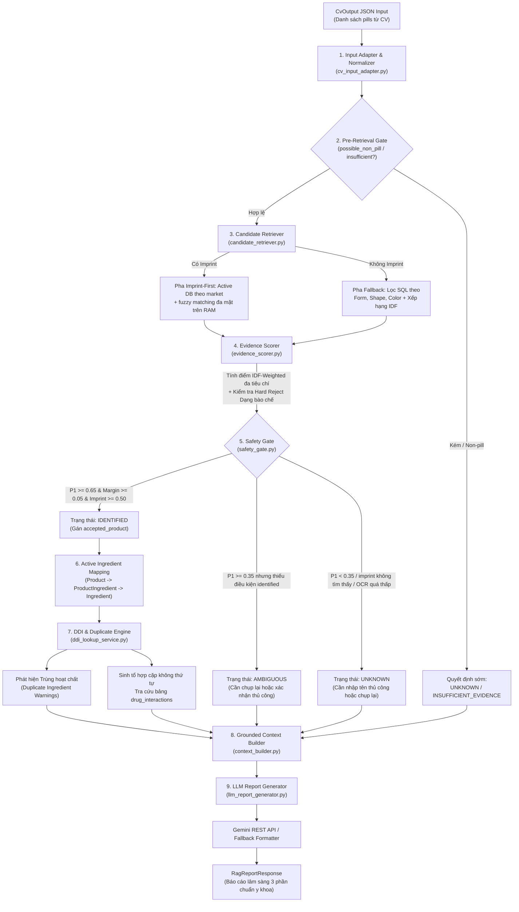
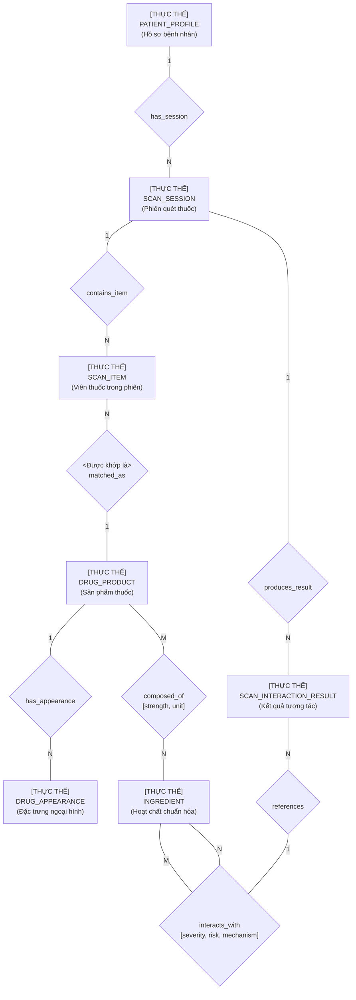
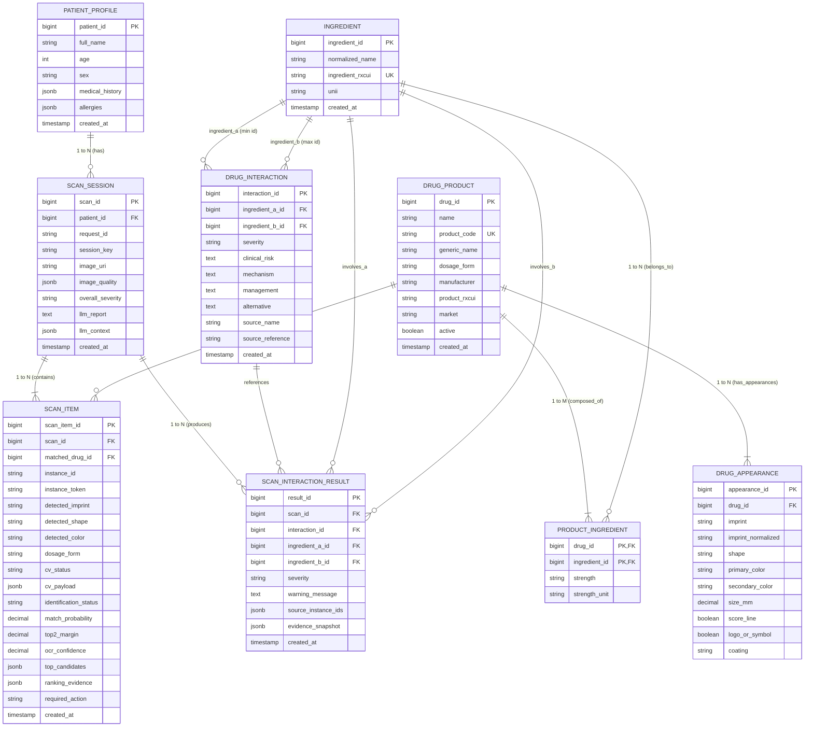

# BẢN ĐẶC TẢ THIẾT KẾ KIẾN TRÚC & PIPELINE MODULE LLM & RAG SAFETY

> **Dự án:** Multiple-Pill Recognition and Interaction Safety  
> **Module:** RAG Drug Identification, DDI Clinical Risk Engine & LLM Medical Safety Reporting  
> **Ranh giới:** Nhận đầu vào có cấu trúc `CvOutput` $\rightarrow$ Chuẩn hóa $\rightarrow$ Truy xuất ứng viên $\rightarrow$ Chấm điểm IDF $\rightarrow$ Safety Gate $\rightarrow$ Ánh xạ Hoạt chất $\rightarrow$ Kiểm tra DDI & Trùng lặp $\rightarrow$ Grounded Context $\rightarrow$ Báo cáo LLM  

---

## 1. PHẠM VI VÀ RANH GIỚI MODULE

Module bắt đầu hoạt động ngay sau khi nhận được dữ liệu JSON có cấu trúc `CvOutput` từ đầu ra của Computer Vision:
- **Nhiệm vụ trọng tâm:**
  1. Chuẩn hóa và mở rộng biến thể chữ khắc OCR (`cv_input_adapter.py`).
  2. Sàng lọc sớm các trường hợp không đủ điều kiện (`safety_gate.py`).
  3. Truy xuất ứng viên thuốc từ cơ sở dữ liệu (`candidate_retriever.py`).
  4. Chấm điểm bằng chứng thích ứng theo độ hiếm IDF (`idf_statistics.py`, `evidence_scorer.py`).
  5. Phân loại mức độ an toàn định danh thuốc qua Safety Gate (`IDENTIFIED`, `AMBIGUOUS`, `UNKNOWN`, `INSUFFICIENT_EVIDENCE`).
  6. Ánh xạ sản phẩm thuốc sang danh mục hoạt chất chuẩn hóa (`ddi_lookup_service.py`).
  7. Kiểm tra trùng lặp hoạt chất (Therapeutic Duplication) và tra cứu tương tác thuốc DDI từ cơ sở dữ liệu (`interaction_service.py`).
  8. Tổng hợp bối cảnh y khoa chuẩn xác (`context_builder.py`).
  9. Sinh báo cáo an toàn y tế Tiếng Việt định dạng 3 phần với Banner 4 cấp độ cảnh báo (`llm_report_generator.py`).
  10. Hỗ trợ luồng can thiệp thủ công từ người dùng đối với các viên thuốc chưa nhận diện được (`manual_identify`).

---

## 2. SƠ ĐỒ PIPELINE XỬ LÝ NỘI BỘ (POST-CV PIPELINE)

---

## 3. CHI TIẾT TỪNG THÀNH PHẦN TRONG CODEBASE HIỆN TẠI

### 3.1. Input Adapter & Normalization (`src/pill_safety/rag/retrieval/cv_input_adapter.py`)
- **Nhiệm vụ:** Tiếp nhận `CvPill` và chuẩn hóa thành đối tượng `RecognitionInput`.
- **Chuẩn hóa chữ khắc & Confusable Expansion:**
  - Loại bỏ ký tự đặc biệt, chuyển UPPERCASE.
  - Tự động sinh tối đa 5 biến thể chữ khắc dễ nhầm lẫn qua ma trận phạt điểm:
    - `O` $\leftrightarrow$ `0` (Phạt: $0.90$)
    - `I` $\leftrightarrow$ `1` $\leftrightarrow$ `L` (Phạt: $0.85$)
    - `S` $\leftrightarrow$ `5` (Phạt: $0.85$)
    - `B` $\leftrightarrow$ `8` (Phạt: $0.80$)
    - `Z` $\leftrightarrow$ `2` (Phạt: $0.80$)
- **Chuẩn hóa hình dạng & màu sắc:** Đưa về tập nhãn chuẩn hóa (`ROUND`, `OVAL`, `OBLONG`, `CAPSULE`, `WHITE`, `GREEN`, `BLUE`...) và áp dụng các hệ số suy giảm chất lượng ảnh (`glare_detected` $\times 0.7$, `lighting_warning` $\times 0.5$, `minor_glare` $\times 0.85$).

### 3.2. Tính toán Thống kê IDF Động (`src/pill_safety/rag/retrieval/idf_statistics.py`)
- **Nhiệm vụ:** Tính toán trọng số độ hiếm cho mọi giá trị đặc trưng trong cơ sở dữ liệu PostgreSQL.
- **Công thức:**
  $$\text{raw\_idf} = \log\left(\frac{N + 1}{\text{count} + 1}\right) + 1$$
  $$\text{normalized} = \frac{\text{raw\_idf} - \text{min\_idf}}{\text{max\_idf} - \text{min\_idf}}$$
  $$\text{idf\_weight} = 0.2 + 0.8 \times \text{normalized} \in [0.2, 1.0]$$
- **Ý nghĩa:** Chữ khắc độc bản nhận trọng số tối đa $1.0$, trong khi màu trắng hoặc hình tròn phổ biến nhận trọng số $0.2$, ngăn chặn việc nhận diện sai lệch do trùng lặp màu sắc/hình dáng phổ thông.

### 3.3. Truy xuất Ứng viên Lai (`src/pill_safety/rag/retrieval/candidate_retriever.py`)
- **Pha 1 (Imprint-First):**
  - Lấy các ứng viên active theo `market`.
  - So khớp mỗi imprint candidate với `imprint_normalized`, `imprint_raw`, `imprint_side_a`, `imprint_side_b` bằng `multi_aspect_imprint_similarity`.
  - Giữ ứng viên có similarity tốt nhất `>= 0.45`, dedupe theo `appearance_id`, rồi cắt theo `limit = 20`.
  - `load_active_candidates()` có tham số `min_len`/`max_len` và hỗ trợ SQL `func.length`, nhưng nhánh `retrieve()` hiện chưa bật lọc độ dài này.
- **Pha 2 (Attribute-Fallback):** Khi không có chữ khắc, lọc ứng viên theo `dosage_form`, `shape`, `primary_color` và sắp xếp theo tổng trọng số IDF.

### 3.4. Chấm điểm Bằng chứng & Bác bỏ Cứng (`src/pill_safety/rag/ranking/evidence_scorer.py`)
- **Chấm điểm từng trường:**
  $$\text{EvidenceScore}_i = \text{IDF\_Weight}_i \times \text{MatchScore}_i \times \text{Confidence}_i \times \text{QualityMultiplier}_i$$
  $$\text{MaxPossibleScore}_i = \text{IDF\_Weight}_i \times \text{Confidence}_i \times \text{QualityMultiplier}_i$$
- **Điểm chung cuộc:** $\text{FinalScore} = \frac{\sum \text{EvidenceScore}_i}{\sum \text{MaxPossibleScore}_i} \in [0.0, 1.0]$.
- **Quy tắc Bác bỏ Cứng (Hard Reject):** Nếu Dạng bào chế quan sát (CV) mâu thuẫn hoàn toàn với DB (Capsule vs Tablet) với độ tin cậy $\ge 0.95$, ứng viên đó bị đánh dấu `hard_reject = True` và bị loại bỏ ngay lập tức.

### 3.5. Bộ Duyệt An toàn (`src/pill_safety/rag/ranking/safety_gate.py`)
Phân loại kết quả vào 4 trạng thái rõ ràng:
1. **`IDENTIFIED`:** `cv_status = features_ready`, có imprint khả dụng, `ocr_confidence >= 0.15`, không phải `possible_merged_instance`, không `hard_reject`, $P_1 \ge 0.65$, khoảng cách điểm $(P_1 - P_2) \ge 0.05$, và điểm khớp chữ khắc $\ge 0.50$ $\rightarrow$ chấp nhận sản phẩm vào danh sách kiểm tra tương tác chắc chắn.
2. **`AMBIGUOUS`:** $P_1 \ge 0.35$ nhưng thiếu một trong các điều kiện `identified`, ví dụ margin quá nhỏ, không có imprint đủ mạnh hoặc có cảnh báo merged instance $\rightarrow$ yêu cầu người dùng chụp lại mặt rõ hơn hoặc xác nhận thủ công.
3. **`UNKNOWN`:** Không có candidate, $P_1 < 0.35$, OCR confidence dưới `0.15`, hoặc có imprint khả dụng nhưng điểm khớp imprint `< 0.30` $\rightarrow$ yêu cầu chụp lại hoặc nhập tên/mã thuốc thủ công.
4. **`INSUFFICIENT_EVIDENCE`:** Ảnh quá mờ hoặc phát hiện vật thể không phải thuốc.

### 3.6. Cơ chế Kiểm tra Tương tác & Trùng lặp Hoạt chất (`src/pill_safety/rag/ddi/ddi_lookup_service.py`)
1. **Ánh xạ Hoạt chất:** Chuyển đổi từ `DrugProduct` sang danh sách `active_ingredients` (thông qua bảng quan hệ `product_ingredients`), lưu giữ `source_instance_id` và `source_product_id`.
2. **Cảnh báo Trùng Hoạt chất (`duplicate_ingredient_warnings`):** Phát hiện nếu có bất kỳ hoạt chất nào xuất hiện $\ge 2$ lần trong các viên thuốc khác nhau $\rightarrow$ Cảnh báo mức `MAJOR` về nguy cơ quá liều độc tính.
3. **Tra cứu Cặp Tương tác:** Sinh toàn bộ $\frac{n(n-1)}{2}$ cặp hoạt chất không thứ tự ($A < B$), tra cứu trên bảng `drug_interactions` để lấy: `severity`, `clinical_risk`, `mechanism`, `management`, `alternative`, `source`.
4. **Tính Mức Độ Nghiêm Trọng Tổng Thể (`overall_severity`):**
   - Xếp hạng: `contraindicated` (4) > `major` (3) > `moderate` (2) > `minor` (1) > `none` (0).
   - Nếu có cảnh báo trùng hoạt chất, mức độ tối thiểu được đẩy lên `major`.

### 3.7. Đóng gói Bối cảnh Y khoa (`src/pill_safety/rag/reporting/context_builder.py`)
- Tổng hợp `identified_drugs`, `unresolved_pills` (kèm lý do và hành động yêu cầu), `interactions`, `duplicate_ingredient_warnings`, `scope_warnings` (`only_identified_drugs_checked`, `no_interaction_found_does_not_mean_safe`) và bảng danh mục nguồn trích dẫn y khoa đã khử trùng lặp (`sources`).

### 3.8. Sinh Báo cáo Y khoa & Cơ chế Dự phòng (`src/pill_safety/rag/reporting/llm_report_generator.py`)
- **Provider chính (`GeminiLlmProvider`):** Gọi trực tiếp REST API của Google Gemini với System Prompt nghiêm ngặt (Zero Hallucination for Pairs, cấm tự tạo tương tác ngoài context).
- **Provider dự phòng (`FallbackLlmProvider`):** Bộ tạo báo cáo tất định dựa trên mã nguồn Python thuần túy, hoạt động hoàn hảo khi không có internet hoặc thiếu API key.
- **Cấu trúc Báo cáo 3 phần chuẩn y khoa:**
  - **Banner mức độ cảnh báo:**
    - `[🔴 MỨC ĐỘ BÁO ĐỘNG: CỰC KỲ NGUY HIỂM]`
    - `[🟧 MỨC ĐỘ BÁO ĐỘNG: TRUNG BÌNH - CẦN THẬN TRỌNG]`
    - `[🟨 MỨC ĐỘ BÁO ĐỘNG: NHẸ / CẦN LƯU Ý]`
    - `[🟢 TÌNH TRẠNG: AN TOÀN - KHÔNG PHÁT HIỆN TƯƠNG TÁC XUNG ĐỘT]`
  - **Phần 1: Kết quả nhận diện thuốc** (Danh sách thuốc đã xác nhận + thuốc chưa nhận diện kèm hướng dẫn gõ lại).
  - **Phần 2: Chi tiết các tương tác gây hại** (Cặp xung đột, tác hại lâm sàng, cơ chế, khuyên dùng, thuốc thay thế, trích dẫn nguồn).
  - **Phần 3: Tổng kết khuyến cáo & Hướng xử lý** (Đề xuất hệ thống, khuyến nghị hành động từng bước, disclaimer y tế).

### 3.9. Luồng Can thiệp Thủ công (`src/pill_safety/rag/identification_service.py`)
- Phương thức `manual_bind_unresolved_pill`: Nhận `instance_id` và `manual_drug_name` hoặc `product_id` từ người dùng, tra cứu thuốc chính xác trong DB và chuyển trạng thái viên thuốc đó thành `identified` với `decision_reasons: ["manual_user_override"]`, cho phép cập nhật lại tương tác DDI ngay lập tức.

---

## 4. BẢNG MÃ LỖI VÀ TRẠNG THÁI HỆ THỐNG

| Trạng thái / Mã lỗi | Ý nghĩa lâm sàng | Hành động tiếp theo |
|---|---|---|
| `identified` | Thuốc được định danh chính xác với độ tin cậy cao và margin an toàn. | Đưa vào kiểm tra tương tác DDI. |
| `ambiguous` | Top-1 đạt ngưỡng review (`>= 0.35`) nhưng chưa đủ điều kiện `identified`, thường do margin `< 0.05`, thiếu imprint usable hoặc có cảnh báo merged instance. | Yêu cầu chụp lại close-up/mặt sau hoặc xác nhận thủ công. |
| `unknown` | Không có candidate, điểm Top-1 `< 0.35`, imprint không tìm thấy trong DB hoặc OCR confidence `< 0.15`. | Cung cấp thanh tìm kiếm tên thuốc thủ công hoặc yêu cầu chụp lại rõ hơn. |
| `insufficient_visual_evidence` | Ảnh bị mờ, lóa sáng hoàn toàn hoặc không phải viên thuốc. | Hướng dẫn người dùng chụp lại ảnh rõ nét. |
| `duplicate_ingredient` | Đơn thuốc chứa $\ge 2$ sản phẩm có cùng hoạt chất. | Cảnh báo mức `MAJOR` về nguy cơ quá liều độc tính. |
| `contraindicated` | Tương tác nguy hiểm có thể đe dọa tính mạng hoặc gây tàn tật. | Cảnh báo mức `CỰC KỲ NGUY HIỂM`, đề xuất không uống đơn thuốc. |

---

## 5. TỔ CHỨC CƠ SỞ DỮ LIỆU & MÔ HÌNH QUAN HỆ THỰC THỂ (E-R MODEL)

### 5.1. Mô hình Quan hệ Thực thể

---

### 5.2. Phân tích Các Thành phần Thực thể & Mối quan hệ (E-R Analysis)
*(Theo đúng phương pháp luận phân tích cơ sở dữ liệu: Liệt kê thực thể, Thuộc tính khóa, Miền giá trị và Bản số liên kết)*

#### a. Danh sách Tập Thực thể (Entity Sets) & Thuộc tính
1. **`PATIENT_PROFILE` (Hồ sơ bệnh nhân):**
   - *Thuộc tính khóa:* <u>`patient_id`</u> (BigInteger).
   - *Thuộc tính đơn trị:* `full_name` (String), `age` (Integer), `sex` (String), `created_at` (DateTime).
   - *Thuộc tính phức hợp / JSON:* `medical_history` (JSONB), `allergies` (JSONB).
2. **`SCAN_SESSION` (Phiên quét thuốc):**
   - *Thuộc tính khóa:* <u>`scan_id`</u> (BigInteger).
   - *Thuộc tính đơn trị:* `request_id`, `session_key`, `image_uri`, `overall_severity`, `created_at`.
   - *Thuộc tính văn bản & JSON:* `llm_report` (Text), `llm_context` (JSONB), `image_quality` (JSONB).
3. **`SCAN_ITEM` (Viên thuốc trong phiên quét):**
   - *Thuộc tính khóa:* <u>`scan_item_id`</u> (BigInteger).
   - *Thuộc tính quan sát từ CV:* `detected_imprint`, `detected_shape`, `detected_color`, `dosage_form`, `cv_status`.
   - *Thuộc tính định danh & chấm điểm:* `identification_status`, `match_probability`, `top2_margin`, `ocr_confidence`.
   - *Thuộc tính chẩn đoán JSON:* `top_candidates` (JSONB), `ranking_evidence` (JSONB), `cv_payload` (JSONB).
4. **`DRUG_PRODUCT` (Sản phẩm thuốc thương mại):**
   - *Thuộc tính khóa:* <u>`drug_id`</u> (BigInteger).
   - *Thuộc tính duy nhất (UK):* `product_code` (Mã NDC / Clinical Drug Code).
   - *Thuộc tính đơn trị:* `name`, `generic_name`, `dosage_form`, `manufacturer`, `product_rxcui`, `market`, `active`.
5. **`DRUG_APPEARANCE` (Đặc tính ngoại hình viên thuốc):**
   - *Thuộc tính khóa:* <u>`appearance_id`</u> (BigInteger).
   - *Thuộc tính đặc trưng thị giác:* `imprint`, `imprint_normalized`, `shape`, `primary_color`, `secondary_color`, `size_mm`, `score_line`, `logo_or_symbol`, `coating`.
6. **`INGREDIENT` (Hoạt chất chuẩn hóa):**
   - *Thuộc tính khóa:* <u>`ingredient_id`</u> (BigInteger).
   - *Thuộc tính duy nhất (UK):* `ingredient_rxcui` (RxNorm CUI).
   - *Thuộc tính đơn trị:* `normalized_name`, `unii`.
7. **`SCAN_INTERACTION_RESULT` (Bản ghi kết quả tương tác phát hiện được):**
   - *Thuộc tính khóa:* <u>`result_id`</u> (BigInteger).
   - *Thuộc tính đơn trị:* `severity`, `warning_message`.
   - *Thuộc tính JSON:* `source_instance_ids` (JSONB), `evidence_snapshot` (JSONB).

#### b. Danh sách Mối quan hệ (Relationships) & Thuộc tính của quan hệ
1. **`has_session` (PATIENT_PROFILE --- SCAN_SESSION):** Quan hệ $1-N$ (Một bệnh nhân có nhiều phiên quét).
2. **`contains_item` (SCAN_SESSION --- SCAN_ITEM):** Quan hệ $1-N$ (Một phiên quét chứa nhiều viên thuốc).
3. **`has_appearance` (DRUG_PRODUCT --- DRUG_APPEARANCE):** Quan hệ $1-N$ (Một sản phẩm thuốc có nhiều dạng ngoại hình).
4. **`composed_of` (DRUG_PRODUCT --- INGREDIENT):** Quan hệ $M-N$ biểu diễn qua bảng `product_ingredients` (Thuộc tính quan hệ: `strength`, `strength_unit`).
5. **`interacts_with` (INGREDIENT --- INGREDIENT):** Quan hệ phản thân nhiều-nhiều ($M-N$) biểu diễn qua bảng `drug_interactions` với $id_A < id_B$ (Thuộc tính quan hệ: `severity`, `clinical_risk`, `mechanism`, `management`, `alternative`, `source_name`, `source_reference`).
6. **`matched_as` (SCAN_ITEM --- DRUG_PRODUCT):** Quan hệ $N-1$ (Nhiều viên thuốc được định danh về 1 sản phẩm).
7. **`produces_result` (SCAN_SESSION --- SCAN_INTERACTION_RESULT):** Quan hệ $1-N$ (Một phiên quét sinh ra nhiều kết quả tương tác).

---

### 5.3. Lược đồ Quan hệ Logic (Logical Relational ERD)

---

