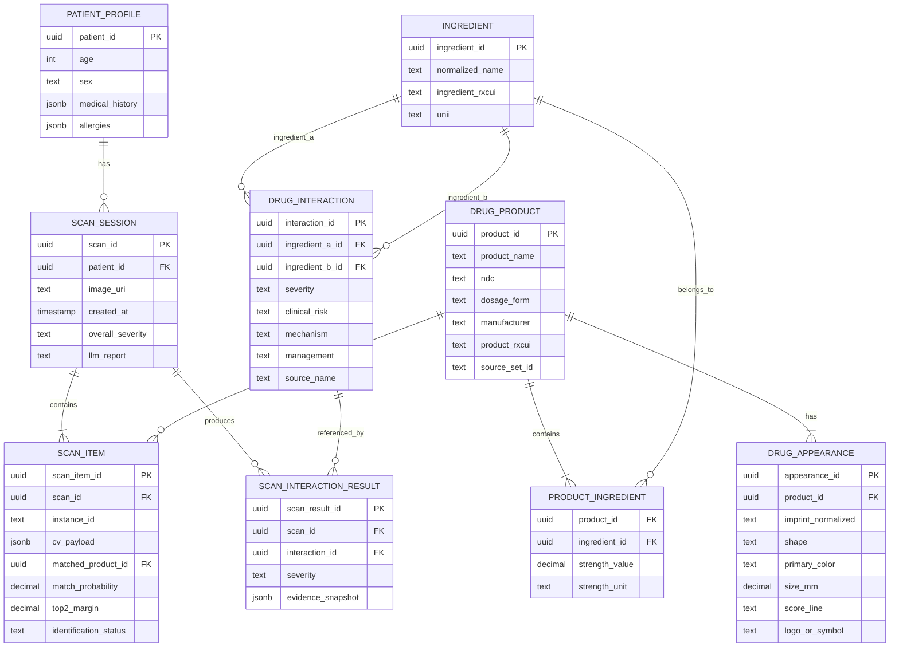
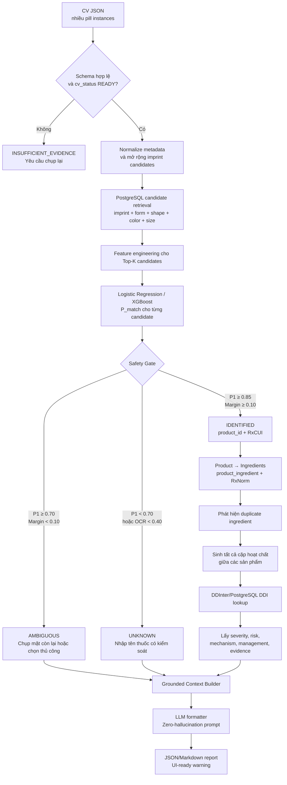
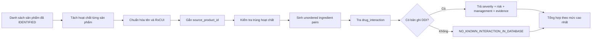

# BÁO CÁO THIẾT KẾ MODULE NHẬN DIỆN THUỐC VÀ PHÁT HIỆN XUNG ĐỘT THUỐC

## 1. Phạm vi module

Module nhận đầu ra có cấu trúc từ mô hình Computer Vision (CV), định danh từng viên thuốc trong ảnh, ánh xạ sản phẩm sang các hoạt chất, kiểm tra tương tác giữa các hoạt chất và trả về cảnh báo có dẫn nguồn.

Nguyên tắc thiết kế:

- CV chỉ cung cấp bằng chứng thị giác; module nhận diện mới quyết định thuốc phù hợp trong cơ sở dữ liệu.
- Nhận diện được thực hiện ở mức **sản phẩm thuốc/ngoại hình viên thuốc**.
- Phát hiện xung đột được thực hiện ở mức **hoạt chất chuẩn hóa**.
- Chỉ các thuốc ở trạng thái `IDENTIFIED` mới được đưa vào kiểm tra tương tác chắc chắn.
- LLM chỉ định dạng và diễn giải dữ liệu đã truy xuất; không tự tạo tương tác hoặc khuyến cáo ngoài cơ sở dữ liệu.
- Hệ thống phải hỗ trợ `AMBIGUOUS`, `UNKNOWN` và `INSUFFICIENT_EVIDENCE`, không ép chọn Top-1 khi bằng chứng không đủ.

---

## 2. Input nhận từ model CV

### Các trường bắt buộc
- imprint_candidates: Danh sách các chuỗi ký tự, chữ số hoặc mã khắc/in trên viên thuốc mà OCR dự đoán được, kèm độ tin cậy. Ví dụ: ["APO500", "AP05OO"].
- shape: Hình dạng của viên thuốc, như tròn, bầu dục, thuôn dài, viên nang, tam giác, vuông hoặc hình thoi.
- color: Màu sắc của viên thuốc, gồm màu chính, màu phụ và kiểu phối màu. Ví dụ: trắng, xanh–trắng hoặc đỏ–vàng.
- dosage_form: Dạng bào chế quan sát được, chỉ phạm vi là viên nan hay viên nén.
- score_line: Vạch chia trên bề mặt viên thuốc, như không có vạch, một vạch, vạch chữ thập hoặc nhiều vạch.
- logo_or_symbol: Logo nhà sản xuất hoặc ký hiệu đặc biệt trên viên, chỉ là có hay không.
- ocr_confidence (Bắt buộc cho Bước E ML): Độ tin cậy của OCR (VD: 0.92 - 92%). Mô hình ML ở Bước E bắt buộc cần chỉ số này để tính imprint_score.
- cv_status (Trạng thái nhận diện từ CV): Nhãn báo cho RAG biết chất lượng ảnh (VD: "features_ready", "insufficient_visual_evidence").

---

## 3. Output của module phát hiện xung đột

### 3.1. Cấu trúc output đề xuất

#### - mức độ cảnh báo (có thể chia làm 4 mức độ: nguy hiểm, trung bình, yếu, không có vấn đề)
cụ thể:

nghiêm trọng: uống vào là chết hoặc bị phản ứng nghiêm trọng
vd:
Amiodarone (Thuốc tim) + Levofloxacin (Kháng sinh)Gây kéo dài khoảng QT tim nghiêm trọng Dẫn đến Torsades de Pointes (Xoắn đỉnh), gây ngừng tim đột ngột và tử vong tức thì.

trung bình: không gây phản ứng ngay nhưng sẽ gây hại lâu dài
vd:
Ibuprofen (Giảm đau NSAID) + Spironolactone (Thuốc huyết áp)Ibuprofen làm giảm khả năng thải trừ Kali của Spironolactone và gây co mạch thận => Dùng lâu dài gây suy thận mãn tính và tăng Kali máu ẩn tàng.

yếu: gây tác dụng yếu hoặc chỉ phản ứng nhẹ, không để lại hậu quả sau này
vd:
Amoxicillin (Kháng sinh) + Paracetamol (Hạ sốt)Paracetamol có thể làm chậm quá trình hấp thu Amoxicillin một chút => Giảm nhẹ tốc độ tác dụng, không gây độc hay tổn thương cơ thể.

không có vấn đề: 

#### - danh sách các thuộc nhận diện được và chưa được (có thêm phần tự nhập tên thuốc cho người dùng có thể nhập tên các thuốc chưa nhận diện được)
#### - danh sách tập hợp các thuốc gây hại cho nhau và khuyến cáo
#### - chi tiết về tác dụng gây hại của nó

ví dụ:
================================================================================
                    KẾT QUẢ PHÂN TÍCH TƯƠNG TÁC THUỐC
================================================================================

[🔴 MỨC ĐỘ BÁO ĐỘNG: CỰC KỲ NGUY HIỂM]
--------------------------------------------------------------------------------
⚠️ CẢNH BÁO: Phát hiện tương tác có thể GÂY TỬ VONG hoặc TÀN TẬT VĨNH VIỄN. 
Vui lòng KHÔNG UỐNG kết hợp các thuốc này khi chưa có chỉ định của Bác sĩ!


--------------------------------------------------------------------------------
1. KẾT QUẢ NHẬN DIỆN THUỐC
--------------------------------------------------------------------------------
✅ Đã nhận diện được (3/4 thuốc):
   1. Cordarone 200mg (Hoạt chất chính: Amiodarone)
   2. Tavanic 500mg (Hoạt chất chính: Levofloxacin)
   3. Panadol Extra (Hoạt chất chính: Paracetamol, Caffeine)

❓ Chưa nhận diện được (1 thuốc):
   • "Thuoc xit mui mau xanh"
   👉 [Nút hành động]: [Click vào đây để gõ/tìm lại tên thuốc chuẩn]


--------------------------------------------------------------------------------
2. CHI TIẾT CÁC TƯƠNG TÁC GÂY HẠI
--------------------------------------------------------------------------------

🔴 TƯƠNG TÁC 1: CỰC KỲ NGUY HIỂM (Nguy cơ tử vong)
- Cặp thuốc xung đột: Cordarone 200mg (Amiodarone) ⚡ Tavanic 500mg (Levofloxacin)
- Tác hại cụ thể: Sự kết hợp này làm cộng dồn tác dụng kéo dài khoảng QT trên điện tâm đồ, rất dễ dẫn đến rối loạn nhịp tim nguy hiểm gọi là "Xoắn đỉnh" (Torsades de Pointes). Rối loạn này có thể chuyển thành rung thất và gây NGHỮNG TIM ĐỘT NGỘT.
- Khuyên dùng: TUYỆT ĐỐI KHÔNG UỐNG CÙNG LÚC. Cần liên hệ ngay với Bác sĩ kê đơn để thay thế kháng sinh Tavanic bằng một nhóm kháng sinh khác an toàn hơn cho tim.

--------------------------------------------------------------------------------

🟨 TƯƠNG TÁC 2: YẾU (Ảnh hưởng nhẹ)
- Cặp thuốc xung đột: Tavanic 500mg (Levofloxacin) ⚡ Panadol Extra (Caffeine)
- Tác hại cụ thể: Levofloxacin làm giảm khả năng thải trừ Caffeine của cơ thể, làm tăng nhẹ nồng độ Caffeine trong máu. Có thể gây ra cảm giác bồn chồn, tim đập nhanh nhẹ hoặc khó ngủ thoáng qua, không gây tổn thương lâu dài.
- Khuyên dùng: Có thể tiếp tục sử dụng. Hạn chế uống thêm cà phê hoặc trà đặc trong thời gian dùng thuốc.


--------------------------------------------------------------------------------
3. TỔNG KẾT KHUYẾN CÁO VÀ HƯỚNG XỬ LÝ
--------------------------------------------------------------------------------
⛔ HỆ THỐNG ĐỀ XUẤT: KHÔNG NÊN UỐNG ĐƠN THUỐC NÀY.

Khuyến nghị hành động:
1. Tạm ngưng việc uống chung Cordarone và Tavanic.
2. Vui lòng bấm vào phần "Chưa nhận diện được" ở trên để bổ sung đầy đủ tên thuốc xịt mũi nhằm phân tích chính xác nhất.
3. Mang danh sách thuốc này trao đổi lại với Bác sĩ hoặc Dược sĩ lâm sàng.

--------------------------------------------------------------------------------
* Disclaimer: Kết quả phân tích dựa trên dữ liệu y khoa chuẩn hóa (RxNorm/DrugBank). 
Thông tin chỉ mang tính chất tham khảo và không thay thế cho chẩn đoán y khoa.
================================================================================

---

## 4. Cấu trúc database PostgreSQL

### 4.1. Các bảng chính

#### `drug_product`

Lưu sản phẩm thuốc cụ thể phục vụ nhận diện.

| Cột | Kiểu gợi ý | Ghi chú |
|---|---|---|
| `product_id` | UUID PK | Khóa chính nội bộ |
| `product_name` | TEXT | Tên sản phẩm/tên thương mại |
| `ndc` | TEXT UNIQUE NULL | Mã sản phẩm/bao bì tại Hoa Kỳ |
| `dosage_form` | TEXT | Dạng bào chế |
| `manufacturer` | TEXT | Nhà sản xuất/labeler |
| `product_rxcui` | TEXT NULL | RxCUI cấp sản phẩm/clinical drug |
| `source_set_id` | UUID/TEXT NULL | DailyMed SET ID |
| `active` | BOOLEAN | Trạng thái bản ghi |

#### `ingredient`

Lưu hoạt chất chuẩn hóa dùng cho DDI.

| Cột | Kiểu gợi ý | Ghi chú |
|---|---|---|
| `ingredient_id` | UUID PK | Khóa chính nội bộ |
| `normalized_name` | TEXT | Tên hoạt chất chuẩn hóa |
| `ingredient_rxcui` | TEXT UNIQUE NULL | RxCUI hoạt chất |
| `unii` | TEXT NULL | Mã định danh chất nếu có |

#### `product_ingredient`

Bảng nối nhiều-nhiều giữa sản phẩm và hoạt chất.

| Cột | Kiểu gợi ý | Ghi chú |
|---|---|---|
| `product_id` | UUID FK | Tham chiếu `drug_product` |
| `ingredient_id` | UUID FK | Tham chiếu `ingredient` |
| `strength_value` | NUMERIC/TEXT | Hàm lượng |
| `strength_unit` | TEXT | mg, mcg... |
| `numerator_text` | TEXT NULL | Giữ biểu diễn gốc nếu cần |

Khóa chính ghép: `(product_id, ingredient_id)`.

#### `drug_appearance`

Lưu đặc trưng ngoại hình để truy xuất từ CV.

| Cột | Kiểu gợi ý |
|---|---|
| `appearance_id` | UUID PK |
| `product_id` | UUID FK |
| `imprint_side_a` | TEXT NULL |
| `imprint_side_b` | TEXT NULL |
| `imprint_normalized` | TEXT NULL |
| `shape` | TEXT |
| `primary_color` | TEXT |
| `secondary_color` | TEXT NULL |
| `color_pattern` | TEXT NULL |
| `size_mm` | NUMERIC NULL |
| `score_line` | TEXT NULL |
| `logo_or_symbol` | TEXT NULL |
| `coating` | TEXT NULL |
| `reference_image_uri` | TEXT NULL |
| `source_name` | TEXT |

#### `drug_interaction`

Lưu tương tác theo **cặp hoạt chất**, không theo cặp tên thương mại.

| Cột | Kiểu gợi ý |
|---|---|
| `interaction_id` | UUID PK |
| `ingredient_a_id` | UUID FK |
| `ingredient_b_id` | UUID FK |
| `severity` | TEXT |
| `mechanism` | TEXT NULL |
| `clinical_risk` | TEXT |
| `management` | TEXT |
| `alternative` | TEXT NULL |
| `source_name` | TEXT |
| `source_reference` | TEXT |
| `last_verified_at` | TIMESTAMPTZ |

Quy tắc chống trùng cặp:

```sql
CHECK (ingredient_a_id < ingredient_b_id);
UNIQUE (ingredient_a_id, ingredient_b_id, source_name);
```

#### `patient_profile`

Lưu ngữ cảnh người dùng nếu phạm vi hệ thống có cá nhân hóa.

| Cột | Kiểu gợi ý |
|---|---|
| `patient_id` | UUID PK |
| `age` | INTEGER NULL |
| `sex` | TEXT NULL |
| `medical_history` | JSONB NULL |
| `allergies` | JSONB NULL |

#### `scan_session`

Lưu một lần chụp/kiểm tra.

| Cột | Kiểu gợi ý |
|---|---|
| `scan_id` | UUID PK |
| `patient_id` | UUID FK NULL |
| `image_uri` | TEXT |
| `created_at` | TIMESTAMPTZ |
| `overall_severity` | TEXT NULL |
| `llm_report` | TEXT NULL |

#### `scan_item`

Lưu kết quả từng viên trong phiên quét.

| Cột | Kiểu gợi ý |
|---|---|
| `scan_item_id` | UUID PK |
| `scan_id` | UUID FK |
| `instance_id` | TEXT |
| `cv_payload` | JSONB |
| `matched_product_id` | UUID FK NULL |
| `match_probability` | NUMERIC NULL |
| `top2_margin` | NUMERIC NULL |
| `identification_status` | TEXT |
| `manual_product_id` | UUID FK NULL |

#### `scan_interaction_result`

Lưu các tương tác được phát hiện trong từng phiên để truy vết.

| Cột | Kiểu gợi ý |
|---|---|
| `scan_result_id` | UUID PK |
| `scan_id` | UUID FK |
| `interaction_id` | UUID FK NULL |
| `ingredient_a_id` | UUID FK |
| `ingredient_b_id` | UUID FK |
| `severity` | TEXT |
| `evidence_snapshot` | JSONB |

### 4.2. Chỉ mục nên tạo

```sql
CREATE EXTENSION IF NOT EXISTS pg_trgm;

CREATE INDEX idx_appearance_imprint_trgm
ON drug_appearance USING gin (imprint_normalized gin_trgm_ops);

CREATE INDEX idx_appearance_filters
ON drug_appearance (shape, primary_color, size_mm, score_line);

CREATE INDEX idx_product_dosage_form
ON drug_product (dosage_form);

CREATE INDEX idx_product_rxcui ON drug_product (product_rxcui);
CREATE INDEX idx_ingredient_rxcui ON ingredient (ingredient_rxcui);
CREATE INDEX idx_ddi_pair ON drug_interaction (ingredient_a_id, ingredient_b_id);
CREATE INDEX idx_scan_item_scan ON scan_item (scan_id);
```

> `dosage_form` có thể đặt trong `drug_product`; khi tạo index ngoại hình, truy vấn join sang `drug_product` hoặc lặp một cột chuẩn hóa trong `drug_appearance` nếu cần tối ưu tốc độ.

---

## 5. Mô hình ER



---

## 6. Nguồn dữ liệu phù hợp và miễn phí

| Nguồn | Dữ liệu lấy | Cách sử dụng trong hệ thống |
|---|---|---|
| [DailyMed – All Drug Labels](https://dailymed.nlm.nih.gov/dailymed/spl-resources-all-drug-labels.cfm) | SPL/XML, tên sản phẩm, NDC, hoạt chất, hàm lượng, dạng bào chế, nhà sản xuất, nhãn thuốc | Nguồn chính cho `drug_product`, `product_ingredient` và evidence từ nhãn |
| [DailyMed Web Services](https://dailymed.nlm.nih.gov/dailymed/app-support-web-services.cfm) | API/đường dẫn tải SPL hiện hành | Đồng bộ từng nhãn hoặc cập nhật định kỳ |
| DailyMed imprint data/API hoặc dữ liệu SPL | Imprint, shape, color, size, score, symbol, coating khi bản ghi có cung cấp | Tạo `drug_appearance`; cần chấp nhận dữ liệu ngoại hình/ảnh có thể thiếu |
| [RxNorm API](https://lhncbc.nlm.nih.gov/RxNav/APIs/RxNormAPIs.html) | Tên chuẩn hóa, RxCUI, quan hệ sản phẩm–hoạt chất | Chuẩn hóa tên thuốc và ánh xạ sang hoạt chất |
| [Prescribable RxNorm API](https://lhncbc.nlm.nih.gov/RxNav/APIs/PrescribableAPIs.html) | Dữ liệu RxNorm kê đơn, API không cần license riêng | Phù hợp cho MVP nếu chỉ cần khái niệm đang dùng |
| [DDInter 2.0](https://ddinter2.scbdd.com/) và [trang tải CSV](https://ddinter2.scbdd.com/download/) | Cặp DDI, severity, cơ chế, nguy cơ, management, therapeutic duplication | Nguồn cấu trúc chính cho `drug_interaction` |
| DailyMed Section 7 – Drug Interactions | Đoạn nhãn chính thức mô tả tương tác | Xác minh các cảnh báo quan trọng và làm evidence cho RAG |
| [NLM TAC Drug–Drug Interaction Corpus](https://bionlp.nlm.nih.gov/tac2018druginteractions/) | Văn bản DDI được gán nhãn | Chỉ dùng tùy chọn cho NLP/RAG evaluation, không phải bảng DDI chính |

### Khuyến nghị nguồn theo từng bảng

```text
DailyMed SPL       → drug_product, product_ingredient, drug_appearance
RxNorm             → ingredient, product_rxcui, ingredient_rxcui
DDInter 2.0        → drug_interaction
DailyMed Section 7 → evidence xác minh cho RAG
Ảnh tự thu thập/kiểm chứng → reference_image_uri và tập test CV
```

Lưu ý:

- DailyMed và RxNorm tập trung vào thị trường/thuật ngữ Hoa Kỳ; phạm vi MVP nên công bố rõ.
- DDInter là nguồn open-access và có trang tải CSV; vẫn cần lưu nguồn, phiên bản và ngày tải cho từng bản ghi.
- Không dùng DrugBank làm nguồn dữ liệu chính nếu yêu cầu toàn bộ pipeline phải miễn phí và có thể phân phối lại, do điều kiện cấp phép có thể không phù hợp với MVP.
- Không giả định mọi sản phẩm DailyMed đều có đủ ảnh hoặc đủ trường ngoại hình; cần đo tỷ lệ thiếu dữ liệu trước khi chốt 30 sản phẩm.

### thuốc đề xuất

#### Quy ước nguồn:

- DailyMed: thành phần, hàm lượng, dạng thuốc, imprint, màu, hình dạng, vạch chia.
- RxNorm: tên chuẩn hóa, hoạt chất và RxCUI.
- DDInter: cặp tương tác và mức độ.

#### thuốc:
- Acetaminophen 500 mg: giảm đau, hạ sốt — hoạt chất acetaminophen — chọn một NDC có imprint rõ; imprint kết hợp hình dạng và màu đủ phân biệt trong DB giới hạn — nguồn: DailyMed, RxNorm, DDInter.
- Ibuprofen 200 mg: giảm đau, hạ sốt, kháng viêm — hoạt chất ibuprofen — nhiều NDC có imprint chứa chữ/số đặc trưng; dạng viên nén và màu hỗ trợ — nguồn: DailyMed, RxNorm, DDInter.
- Naproxen 500 mg: giảm đau, kháng viêm NSAID — hoạt chất naproxen — thường có imprint dài hoặc kèm hàm lượng, hình thuôn và vạch chia — nguồn: DailyMed, RxNorm, DDInter.
- Diclofenac 50 mg: giảm đau và kháng viêm — hoạt chất diclofenac — có thể chọn NDC có imprint chứa mã và hàm lượng, màu đặc trưng — nguồn: DailyMed, RxNorm, DDInter.
- Tramadol 50 mg: điều trị đau mức vừa đến nặng — hoạt chất tramadol — có nhiều NDC với imprint riêng; dễ tách khỏi NSAID bằng imprint — nguồn: DailyMed, RxNorm, DDInter.
- Amoxicillin 500 mg: kháng sinh penicillin — hoạt chất amoxicillin — viên nang thường có hai vùng màu và imprint riêng trên thân/nắp — nguồn: DailyMed, RxNorm, DDInter.
- Amoxicillin–clavulanate 875/125 mg: kháng sinh phối hợp — hoạt chất amoxicillin + clavulanic acid — viên lớn, imprint nhiều ký tự và thường có vạch chia — nguồn: DailyMed, RxNorm, DDInter.
- Azithromycin 500 mg: kháng sinh macrolide — hoạt chất azithromycin — viên nén bầu dục, imprint thường chứa mã riêng theo hàm lượng — nguồn: DailyMed, RxNorm, DDInter.
- Ciprofloxacin 500 mg: kháng sinh fluoroquinolone — hoạt chất ciprofloxacin — imprint thường chứa mã hoặc số 500, kết hợp hình thuôn — nguồn: DailyMed, RxNorm, DDInter.
- Doxycycline 100 mg: kháng sinh tetracycline — hoạt chất doxycycline — thường là viên nang màu và có imprint dài — nguồn: DailyMed, RxNorm, DDInter.
- Metronidazole 500 mg: kháng khuẩn và kháng đơn bào — hoạt chất metronidazole — chọn NDC có imprint riêng, dạng viên nén và màu ổn định — nguồn: DailyMed, RxNorm, DDInter.
- Metformin 500 mg: điều trị đái tháo đường type 2 — hoạt chất metformin — nhiều NDC có imprint số/chữ rõ; hình dạng và vạch chia hỗ trợ — nguồn: DailyMed, RxNorm, DDInter.
- Glimepiride 2 mg: hạ đường huyết — hoạt chất glimepiride — hàm lượng thường được phân biệt bằng imprint và màu — nguồn: DailyMed, RxNorm, DDInter.
- Amlodipine 5 mg: điều trị tăng huyết áp và đau thắt ngực — hoạt chất amlodipine — có các NDC hình đa giác hoặc hình riêng cùng imprint rõ — nguồn: DailyMed, RxNorm, DDInter.
- Losartan 50 mg: điều trị tăng huyết áp — hoạt chất losartan — imprint thường có hai phần; màu và hình bầu dục hỗ trợ — nguồn: DailyMed, RxNorm, DDInter.
- Lisinopril 10 mg: điều trị tăng huyết áp và suy tim — hoạt chất lisinopril — các hàm lượng có imprint/màu riêng, phù hợp phân loại trong DB cố định — nguồn: DailyMed, RxNorm, DDInter.
- Bisoprolol 5 mg: giảm nhịp tim và điều trị tăng huyết áp — hoạt chất bisoprolol — imprint thường kèm số hàm lượng và vạch chia — nguồn: DailyMed, RxNorm, DDInter.
- Furosemide 40 mg: thuốc lợi tiểu quai — hoạt chất furosemide — imprint tương đối rõ, thường có vạch chia và hình tròn — nguồn: DailyMed, RxNorm, DDInter.
- Digoxin 0,125 hoặc 0,25 mg: điều trị một số bệnh suy tim và rối loạn nhịp — hoạt chất digoxin — hai hàm lượng có imprint và màu khác nhau, khả năng phân biệt tốt — nguồn: DailyMed, RxNorm, DDInter.
- Warfarin 2 hoặc 5 mg: thuốc chống đông — hoạt chất warfarin — hàm lượng được mã hóa bằng imprint và màu khác nhau; nhận diện tốt khi OCR rõ — nguồn: DailyMed, RxNorm, DDInter.
- Clopidogrel 75 mg: thuốc chống kết tập tiểu cầu — hoạt chất clopidogrel — imprint nhiều ký tự, màu/hình dạng tương đối ổn định theo NDC — nguồn: DailyMed, RxNorm, DDInter.
- Omeprazole 20 mg: giảm tiết acid dạ dày — hoạt chất omeprazole — thường là viên nang có imprint trên hai phần thân/nắp — nguồn: DailyMed, RxNorm, DDInter.
- Pantoprazole 40 mg: giảm tiết acid dạ dày — hoạt chất pantoprazole — viên nén màu và imprint đặc trưng, dễ phân biệt với omeprazole capsule — nguồn: DailyMed, RxNorm, DDInter.
- Cetirizine 10 mg: giảm triệu chứng dị ứng — hoạt chất cetirizine — chọn NDC có imprint hai phần; hình dạng và màu hỗ trợ — nguồn: DailyMed, RxNorm, DDInter.
- Sertraline 50 mg: thuốc chống trầm cảm SSRI — hoạt chất sertraline — hàm lượng có imprint, màu và vạch chia riêng — nguồn: DailyMed, RxNorm, DDInter.

Ví dụ các nhãn DailyMed cho thấy tramadol, amoxicillin, amoxicillin–clavulanate và azithromycin đều có thể có imprint, màu, hình dạng và dạng vật lý để lập drug_appearance.

Những thuốc đã loại khỏi danh sách 30
Aspirin: nhiều sản phẩm có imprint rất ngắn hoặc không đặc trưng.
Spironolactone: một số NDC có imprint ngắn.
Rivaroxaban: biểu tượng/logo cụ thể có giá trị lớn; Boolean true/false là chưa đủ.
Diphenhydramine: có quá nhiều dạng viên nén, caplet và viên nang.
Gliclazide: độ bao phủ trong nguồn DailyMed/RxNorm của Mỹ không phù hợp bằng các thuốc còn lại.
Các cặp hoạt chất tương tác với nhau

Danh sách dưới đây được lọc từ 8 file CSV công khai của DDInter, chuẩn hóa tên và loại bản ghi trùng. DDInter định nghĩa Major là tương tác có thể đe dọa tính mạng hoặc cần can thiệp; Moderate có thể làm nặng tình trạng hoặc cần thay đổi điều trị; Minor thường hạn chế hiệu quả hoặc làm tăng tác dụng phụ nhưng ít khi cần đổi điều trị.

Major — 8 cặp
Ciprofloxacin + Glimepiride
Ciprofloxacin + Warfarin
Clopidogrel + Omeprazole
Clopidogrel + Warfarin
Diclofenac + Warfarin
Ibuprofen + Warfarin
Metronidazole + Warfarin
Naproxen + Warfarin
Moderate — 60 cặp
Acetaminophen + Warfarin
Amlodipine + Diclofenac
Amlodipine + Ibuprofen
Amoxicillin + Doxycycline
Amoxicillin + Warfarin
Azithromycin + Warfarin
Bisoprolol + Diclofenac
Bisoprolol + Glimepiride
Bisoprolol + Ibuprofen
Cetirizine + Sertraline
Cetirizine + Tramadol
Ciprofloxacin + Diclofenac
Ciprofloxacin + Ibuprofen
Ciprofloxacin + Metformin
Clopidogrel + Diclofenac
Clopidogrel + Ibuprofen
Clopidogrel + Naproxen
Clopidogrel + Pantoprazole
Clopidogrel + Sertraline
Clopidogrel + Tramadol
Diclofenac + Digoxin
Diclofenac + Furosemide
Diclofenac + Glimepiride
Diclofenac + Ibuprofen
Diclofenac + Lisinopril
Diclofenac + Losartan
Diclofenac + Metformin
Diclofenac + Naproxen
Diclofenac + Sertraline
Digoxin + Doxycycline
Digoxin + Ibuprofen
Digoxin + Metformin
Digoxin + Omeprazole
Digoxin + Pantoprazole
Doxycycline + Warfarin
Furosemide + Glimepiride
Furosemide + Ibuprofen
Furosemide + Metformin
Furosemide + Omeprazole
Furosemide + Pantoprazole
Glimepiride + Ibuprofen
Glimepiride + Lisinopril
Glimepiride + Metformin
Glimepiride + Naproxen
Glimepiride + Sertraline
Glimepiride + Warfarin
Ibuprofen + Lisinopril
Ibuprofen + Losartan
Ibuprofen + Metformin
Ibuprofen + Naproxen
Ibuprofen + Sertraline
Lisinopril + Metformin
Metformin + Naproxen
Metformin + Warfarin
Naproxen + Omeprazole
Naproxen + Pantoprazole
Omeprazole + Warfarin
Pantoprazole + Warfarin
Sertraline + Warfarin
Tramadol + Warfarin
Minor — 9 cặp
Amoxicillin + Azithromycin
Azithromycin + Metronidazole
Ciprofloxacin + Metronidazole
Ciprofloxacin + Omeprazole
Clopidogrel + Glimepiride
Doxycycline + Furosemide
Glimepiride + Omeprazole
Metronidazole + Sertraline
Metronidazole + Tramadol
Tổng số tổ hợp
25 sản phẩm thuốc: có tối đa 300 cặp sản phẩm cần kiểm tra.
Do amoxicillin–clavulanate chứa hai hoạt chất, 25 sản phẩm này tạo thành 26 hoạt chất khác nhau.
26 hoạt chất: có tối đa 325 cặp hoạt chất cần kiểm tra.
Trong 8 CSV công khai đã tải và loại trùng:
Major: 8 cặp.
Moderate: 60 cặp.
Minor: 9 cặp.
Tổng cộng: 77 cặp có mức độ xác định.
Giới hạn của con số 77

Con số 77 không phải tổng đầy đủ của toàn bộ DDInter 2.0. DDInter công bố hơn 302.000 bản ghi và có dữ liệu cho toàn bộ các nhóm ATC, trong khi trang tải công khai hiện chỉ cung cấp 8 file phân nhóm.

Ví dụ, giao diện DDInter đầy đủ còn ghi nhận Losartan + Lisinopril là tương tác Major với nguy cơ tăng kali máu, hạ huyết áp và suy giảm chức năng thận, dù cặp này không xuất hiện trong 8 CSV đã lọc.

Vì vậy, khi triển khai chính thức nên:

Sinh 325 cặp hoạt chất
→ tra 8 CSV cục bộ
→ gọi DDInter POST API cho các cặp chưa tìm thấy
→ xác minh Major bằng DailyMed Section 7
→ lưu evidence và ngày cập nhật

---

## 7. Cách triển khai thuật toán và mô hình

## 7.1. Giai đoạn A — Chuẩn hóa input

1. Kiểm tra schema JSON và các trường bắt buộc.
2. Nếu `cv_status != FEATURES_READY`, trả về `INSUFFICIENT_EVIDENCE`.
3. Chuẩn hóa shape/color và chỉ chuẩn hóa dosage form khi `source` cho biết đó là dự đoán thật; bỏ qua `not_predicted_by_attribute`.
4. Chuẩn hóa imprint:
   - Chuyển uppercase.
   - Xóa khoảng trắng và ký tự phân cách không cần thiết.
   - Giữ chuỗi gốc để truy vết.
   - Sinh biến thể có trọng số cho các cặp dễ nhầm: `0↔O`, `1↔I↔L`, `5↔S`, `8↔B`.

## 7.2. Giai đoạn B — Truy xuất ứng viên

Truy vấn theo tầng để không loại nhầm thuốc đúng:

1. Exact match hoặc fuzzy match `imprint_normalized`.
2. Lọc `shape`; chỉ lọc `dosage_form` khi CV có dự đoán thật thay vì `unknown`.
3. Lọc mềm theo `color`, `size`, `score_line`, `logo_or_symbol`; `score_line` phải lấy từ output OCR.
4. Lấy Top-K, đề xuất `K = 10–20`, để đưa vào mô hình xếp hạng.

Ví dụ logic SQL rút gọn:

```sql
SELECT
    p.product_id,
    p.product_name,
    a.*,
    similarity(a.imprint_normalized, :imprint) AS imprint_similarity
FROM drug_appearance a
JOIN drug_product p ON p.product_id = a.product_id
WHERE
    a.imprint_normalized % :imprint
    AND (:dosage_form IS NULL OR p.dosage_form = :dosage_form)
ORDER BY imprint_similarity DESC
LIMIT 20;
```

## 7.3. Giai đoạn C — Tính feature và xếp hạng

Feature cho mỗi cặp `(CV instance, DB candidate)`:

```text
imprint_score
shape_score
color_score
dosage_form_score
size_score
score_line_score
logo_score
ocr_confidence
detection_confidence
```

Feature không có evidence, ví dụ `dosage_form` hiện có `source = not_predicted_by_attribute`, phải được đánh dấu missing và bỏ khỏi phép chấm điểm. Không được thay missing bằng `0`. `score_line_score` dùng quyết định scoreline của OCR, không dùng placeholder từ Attribute.

Mô hình đề xuất:

- **Baseline:** Logistic Regression vì dễ giải thích và kiểm tra trọng số.
- **Mô hình chính:** XGBoost Classifier/Ranker khi có đủ mẫu thật và hard negatives.
- **Không dùng LLM để định danh thuốc.**

Dữ liệu train cần gồm:

- Positive pair: ảnh/metadata đúng với bản ghi thuốc.
- Random negative: thuốc khác rõ ràng.
- Hard negative: cùng màu, cùng shape, gần kích thước nhưng khác imprint/hoạt chất.
- Ảnh mờ, phản quang, chỉ một mặt và thuốc chưa có trong DB.

Dữ liệu synthetic chỉ phù hợp để kiểm thử pipeline và code. Ngưỡng an toàn và báo cáo độ chính xác phải được hiệu chỉnh trên dữ liệu CV thật có nhãn.

## 7.4. Giai đoạn D — Safety Gate

Áp dụng ngưỡng ban đầu từ thiết kế hiện tại, sau đó hiệu chỉnh trên validation set:

```text
IDENTIFIED:
P1 >= 0.85 và (P1 - P2) >= 0.10

AMBIGUOUS:
P1 >= 0.70 nhưng (P1 - P2) < 0.10

UNKNOWN / INSUFFICIENT_EVIDENCE:
P1 < 0.70 hoặc ocr_confidence < 0.40 hoặc CV báo ảnh không đủ bằng chứng
```

Chỉ `IDENTIFIED` được đưa vào DDI chắc chắn. Với `AMBIGUOUS`, yêu cầu chụp mặt còn lại hoặc chọn thủ công trong danh sách có kiểm soát.

## 7.5. Giai đoạn E — Ánh xạ hoạt chất

```text
product_id
→ product_ingredient
→ ingredient_id
→ ingredient_rxcui
```

Một sản phẩm phối hợp có thể trả về nhiều hoạt chất. Mỗi hoạt chất phải giữ `source_product_id` để biết nó đến từ viên nào.

## 7.6. Giai đoạn F — Phát hiện xung đột

1. Gộp tất cả hoạt chất từ các sản phẩm `IDENTIFIED`.
2. Phát hiện cùng hoạt chất xuất hiện trong nhiều sản phẩm → `DUPLICATE_INGREDIENT`.
3. Sinh các cặp không thứ tự giữa các hoạt chất thuộc các sản phẩm khác nhau.
4. Chuẩn hóa thứ tự cặp bằng `min(id), max(id)`.
5. Tra bảng `drug_interaction` bằng index cặp.
6. Lấy severity, mechanism, clinical risk, management và evidence.
7. Chọn `overall_severity` bằng mức nghiêm trọng cao nhất.
8. Nếu có viên chưa xác định, thêm `scope_warning`.

Số cặp cần kiểm tra với `n` hoạt chất khác nhau:

```text
n × (n - 1) / 2
```

Với phạm vi vài chục thuốc trong một lần chụp, truy vấn cặp trong PostgreSQL là nhẹ và không cần mô hình dự đoán DDI.

## 7.7. Giai đoạn G — RAG và LLM

RAG truy xuất:

- Bản ghi DDI có cấu trúc.
- Đoạn bằng chứng tương ứng từ DailyMed hoặc nguồn đã lưu.
- Ngữ cảnh bệnh nhân nếu người dùng đã cung cấp.

LLM chỉ nhận Context JSON và thực hiện:

- Viết báo cáo dễ hiểu.
- Sắp xếp cảnh báo theo mức độ.
- Không thêm tên thuốc, tác hại hoặc cách xử trí ngoài context.
- Luôn hiển thị nguồn và disclaimer.

Có thể triển khai bằng Gemini/OpenAI API hoặc Ollama/local model. Lựa chọn không làm thay đổi logic nhận diện và DDI cốt lõi.

---

## 8. Pipeline nhận diện thuốc và xử lý xung đột



---

## 9. Pipeline xử lý tương tác ở mức hoạt chất



---

## 10. Quy tắc an toàn bắt buộc

1. Không tự động xác nhận thuốc nếu Top-1 và Top-2 quá gần nhau.
2. Không đưa thuốc `AMBIGUOUS/UNKNOWN` vào kết luận DDI chắc chắn.
3. Nếu còn thuốc chưa xác định, báo cáo phải ghi rõ phạm vi phân tích chưa đầy đủ.
4. Không diễn giải `không có bản ghi` thành `chắc chắn an toàn`.
5. Không dùng LLM để sáng tạo severity, cơ chế hoặc khuyến nghị.
6. Mọi tương tác phải có `source_name`, `source_reference`, phiên bản và ngày xác minh.
7. Cảnh báo trùng hoạt chất phải tách khỏi DDI.
8. Khuyến cáo cuối cùng phải hướng người dùng trao đổi với bác sĩ/dược sĩ, đặc biệt với cảnh báo `MAJOR`.

---

## 11. Phạm vi MVP đề xuất

Đối với 2 người thực hiện trong 1 tháng:

- 30 hoạt chất thông dụng.
- 60–80 sản phẩm/NDC cụ thể có ngoại hình đủ dữ liệu.
- 100–300 cặp DDI liên quan được nhập từ DDInter và xác minh các cặp quan trọng bằng DailyMed.
- PostgreSQL làm database chính.
- Logistic Regression làm baseline; XGBoost làm mô hình xếp hạng chính nếu có đủ dữ liệu thật.
- Không xây mô hình dự đoán tương tác mới; chỉ lookup tương tác đã được kiểm chứng.

Tiêu chí hoàn thành:

- Truy xuất Top-K ổn định cho tập thuốc MVP.
- Có trạng thái từ chối nhận diện an toàn.
- Ánh xạ đúng sản phẩm → hoạt chất → RxCUI.
- Phát hiện DDI, trùng hoạt chất và therapeutic duplication.
- Output có severity, tác hại, cơ chế, khuyến nghị, nguồn và cảnh báo phạm vi.

---

## 12. Cấu trúc thư mục triển khai đề xuất

```text
project/
├── app/
│   ├── api/
│   ├── schemas/
│   └── services/
│       ├── cv_input_parser.py
│       ├── imprint_normalizer.py
│       ├── candidate_retriever.py
│       ├── drug_ranker.py
│       ├── safety_gate.py
│       ├── ingredient_mapper.py
│       ├── interaction_checker.py
│       ├── rag_context_builder.py
│       └── report_formatter.py
├── database/
│   ├── migrations/
│   ├── seed_daily_med.py
│   ├── seed_rxnorm.py
│   └── seed_ddinter.py
├── models/
│   └── drug_ranking_model.pkl
├── data/
│   ├── raw/
│   ├── processed/
│   └── validation/
├── tests/
│   ├── test_identification.py
│   ├── test_safety_gate.py
│   ├── test_ddi_lookup.py
│   └── test_end_to_end.py
└── report.md
```

---

## 13. Kết luận thiết kế

Thiết kế phù hợp nhất là:

```text
CV metadata
→ truy xuất và xếp hạng sản phẩm thuốc
→ Safety Gate
→ ánh xạ sản phẩm sang toàn bộ hoạt chất
→ phát hiện trùng hoạt chất
→ tra từng cặp hoạt chất trong DDInter/PostgreSQL
→ lấy bằng chứng DailyMed
→ LLM chỉ định dạng báo cáo
```

Kiến trúc này khả thi cho phạm vi MVP, giảm trùng lặp dữ liệu tương tác, hỗ trợ thuốc phối hợp nhiều hoạt chất và giữ được ranh giới an toàn giữa nhận diện, truy xuất y khoa và sinh ngôn ngữ.

---

## Tài liệu nội bộ đã tổng hợp

- `input(3).md`: trường input từ CV.
- `llm(2).md`: kiến trúc PostgreSQL, RAG và vai trò LLM.
- `llm_rag_pipeline(2).md`: pipeline, Safety Gate và các quy tắc cứng.
- `ranking_ml_models(2).md`: Logistic Regression, XGBoost và hard negative mining.
- `output(2).md`: yêu cầu output và bố cục cảnh báo.
