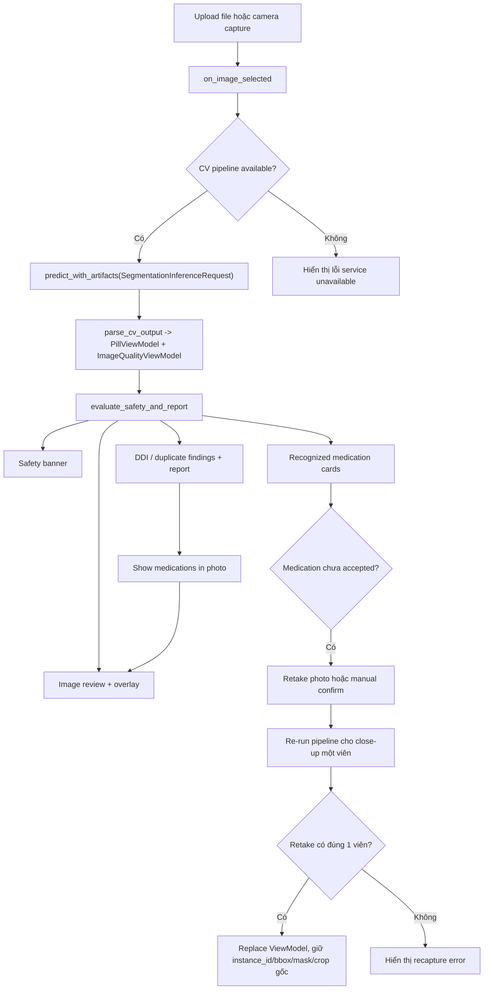

# Clinical UI Workspace

Tài liệu này mô tả UI Streamlit hiện tại sau khi tích hợp các điều chỉnh giao diện từ nhánh `FE_Final`. UI không gọi trực tiếp raw backend payload trong component render; mọi dữ liệu chính đi qua lớp adapter và ViewModel để giữ giao diện ổn định khi schema nội bộ thay đổi.

---

## 1. Phạm vi

UI hiện tại phục vụ 3 việc chính:

1. Nhận ảnh thuốc từ upload hoặc camera.
2. Chạy pipeline nhận diện thuốc, trình bày evidence thị giác và trạng thái định danh từng viên.
3. Hiển thị cảnh báo DDI/trùng hoạt chất, cho phép highlight đúng viên thuốc trong ảnh, chụp lại close-up hoặc xác nhận thủ công khi hệ thống chưa chắc.

Entrypoint chính của workspace là:

```text
ui/views/analyze_view.py
```

Các component chính:

```text
ui/components/upload_panel.py
ui/components/visual_viewer.py
ui/components/pill_cards.py
ui/components/recapture_panel.py
ui/components/interaction_cards.py
ui/components/clinical_report.py
ui/components/evidence_details.py
ui/drawing_utils.py
ui/adapters/pipeline_adapter.py
ui/adapters/view_models.py
```

---

## 2. Luồng xử lý người dùng



---

## 3. Presenter Layer

`ui/adapters/view_models.py` định nghĩa các ViewModel để component không phụ thuộc trực tiếp vào schema Pydantic/backend.

| ViewModel | Mục đích |
|---|---|
| `PillViewModel` | Một viên thuốc đã detect, gồm status UI, visual evidence, bbox/mask/crop, thông tin thuốc đã match, top candidates và action cần làm. |
| `CandidateViewModel` | Một ứng viên DB để hiển thị so sánh evidence. |
| `ImageQualityViewModel` | Trạng thái chất lượng ảnh: blur, glare, lighting và notes. |
| `InteractionPairViewModel` | Một cặp tương tác DDI. Field `source_instances` giữ các `instance_id` tạo ra cảnh báo để UI highlight đúng viên trong ảnh. |
| `DuplicateIngredientViewModel` | Cảnh báo trùng hoạt chất và danh sách viên liên quan. |
| `SafetyReportViewModel` | Báo cáo safety tổng hợp dùng cho banner, card DDI, duplicate và report text. |

Status UI trong `PillViewModel.status`:

| Status | Nhãn UI | Ý nghĩa |
|---|---|---|
| `accepted` | `IDENTIFIED` | Có thuốc đã match đủ tin cậy hoặc đã được xác nhận thủ công. |
| `ambiguous` | `NEEDS REVIEW` | Có evidence nhưng chưa đủ chắc để dùng như kết luận cuối. |
| `unresolved` | `UNRESOLVED` | Không đủ evidence hoặc chưa tìm thấy thuốc phù hợp. |
| `rejected` | `Not usable` trong evidence details | Dự phòng cho dữ liệu không dùng được. |

---

## 4. Adapter và Safety Evaluation

`ui/adapters/pipeline_adapter.py` có 2 hàm chính:

### `parse_cv_output(raw_cv_data)`

Nhận dict scenario hoặc object output thật từ CV pipeline và trả:

```python
tuple[list[PillViewModel], ImageQualityViewModel]
```

Hành vi hiện tại:

- Đọc `image_quality`, `pills`, `shape`, `color`, `imprint`, `scoreline`, `bbox_xyxy`, `mask_path`, `crop_path`.
- Chuẩn hóa imprint qua `normalize_imprint`.
- Thử match thuốc trong database thật trước bằng `_find_drug_in_database`.
- Nếu DB không sẵn sàng hoặc không match, fallback sang `KNOWN_DRUG_DATABASE` để demo vẫn chạy được.
- Nếu match được thuốc, tạo `CandidateViewModel` rank 1 với score hiển thị demo.
- Nếu chưa match, status là `ambiguous` khi có imprint hoặc `unresolved` khi thiếu imprint.

### `evaluate_safety_and_report(pills, manual_overrides=None)`

Hành vi hiện tại:

- Áp dụng manual override theo `instance_id`.
- Map hoạt chất từ các thuốc `accepted`.
- Cảnh báo duplicate ingredient khi cùng hoạt chất xuất hiện trong nhiều viên.
- Tra cứu DDI từ DB thật nếu có session DB; nếu không, fallback sang `KNOWN_DDI_MATRIX`.
- Khi tạo `InteractionPairViewModel`, field `source_instances` chứa union các viên thuốc tạo ra hai hoạt chất tương tác. UI dùng field này để highlight overlay đúng viên, không đoán bằng tên hiển thị.
- Tính `overall_severity`: `critical` nếu có critical DDI, `moderate` nếu có duplicate hoặc major/moderate DDI, `unresolved` nếu còn viên chưa xác định, còn lại là `safe`.

---

## 5. Workspace State

`render_analyze_view()` dùng `st.session_state` để giữ trạng thái tương tác:

| Key | Vai trò |
|---|---|
| `current_image`, `current_image_name` | Ảnh gốc và tên ảnh đang phân tích. |
| `raw_cv_data`, `cv_error` | Output pipeline hoặc lỗi phân tích. |
| `selected_pill_id` | Viên đang focus trong overlay và cards. |
| `manual_overrides` | Map `instance_id -> user input` cho xác nhận thủ công. |
| `recapture_results` | Kết quả pipeline từ ảnh close-up, map theo `instance_id` gốc. |
| `recapture_errors` | Lỗi retake theo từng viên. |
| `highlighted_pill_ids` | Danh sách viên được highlight do một DDI finding. |
| `active_interaction_index` | Cảnh báo DDI đang chọn. |
| `scroll_to_medication_photo` | Bật scroll về vùng ảnh khi người dùng chọn DDI finding. |
| `focused_retake_pill_id` | Viên đang mở panel retake/manual confirm. |

Khi người dùng chọn ảnh mới, các state liên quan đến override, retake, highlight và selected pill được reset để tránh dùng evidence cũ cho ảnh mới.

---

## 6. Visual Evidence Viewer

`render_visual_viewer()` hiển thị ảnh đã annotate và các chip chất lượng ảnh.

Overlay được vẽ bởi `draw_cv_overlay()`:

| Trường hợp | Màu overlay | Ưu tiên |
|---|---|---|
| Viên đang selected | Cyan | Cao nhất |
| Viên liên quan đến DDI đang chọn | Green | Sau selected |
| Viên còn lại | Red/coral | Mặc định |

Nếu `mask_path` tồn tại, mask được resize vào bbox và tô tint bán trong suốt. Nếu mask không đọc được, UI bỏ qua lỗi để không làm hỏng toàn bộ màn hình.

Dropdown `Selected medication` đồng bộ với `selected_pill_id`. Khi dữ liệu pill thay đổi và selected id không còn hợp lệ, state dropdown được xóa để tránh Streamlit giữ lựa chọn cũ.

---

## 7. Medication Cards và Retake

`render_pill_cards()` hiển thị từng viên thuốc dưới dạng card compact:

- Tên thuốc hoặc `Medication not confidently identified`.
- Shape/color confidence.
- Imprint raw.
- Scoreline visible/not visible.
- RxCUI/NDC nếu có.
- Nút `Show in image` để focus overlay.
- Nút `Retake photo` chỉ hiện khi `pill.status != "accepted"` và chưa manual override.

`render_retake_controls()` cung cấp 2 cách xử lý viên chưa chắc:

1. Chụp/upload close-up một viên và bấm `Analyze this retake`.
2. Nhập imprint hoặc tên thuốc và bấm `Confirm manually`.

Retake phải chứa đúng một viên thuốc. Nếu pipeline trả nhiều hơn hoặc không có viên nào, UI giữ nguyên kết quả cũ và ghi lỗi vào `recapture_errors`.

Khi retake thành công, `analyze_view.py` dùng `dataclasses.replace()` để thay nội dung nhận diện bằng kết quả close-up nhưng vẫn giữ:

```text
instance_id
bbox_xyxy
mask_path
crop_path
```

Điều này đảm bảo overlay vẫn trỏ về đúng vị trí viên thuốc trong ảnh gốc.

---

## 8. Safety Findings và Report

`render_safety_banner()` là thông tin ưu tiên cao nhất sau khi phân tích:

| `overall_severity` | Nghĩa UI |
|---|---|
| `critical` | Có tương tác nghiêm trọng cần review chuyên môn. |
| `moderate` | Có tương tác/duplicate cần xem xét. |
| `unresolved` | Còn viên chưa định danh đủ chắc. |
| `safe` | Không tìm thấy tương tác có hại trong database hiện tại giữa các thuốc đã định danh. |

`render_interaction_cards()` hiển thị:

- Duplicate ingredient warnings trước nếu có.
- Pairwise DDI cards sau đó.
- Nút `Show medications in photo` cho mỗi DDI nếu có `source_instances`.

Khi bấm `Show medications in photo`, UI:

1. Set `highlighted_pill_ids` bằng `source_instances`.
2. Set `selected_pill_id` thành viên đầu tiên trong cặp.
3. Scroll về vùng `#medication-photo`.
4. Viewer tô xanh các viên liên quan để người dùng thấy cảnh báo xuất phát từ viên nào.

`render_clinical_report()` đặt báo cáo trong khung scroll riêng và cho tải `.txt`.

---

## 9. Design Tokens và Accessibility Notes

`ui/styles.py` định nghĩa hệ màu clinical light-mode:

| Token group | Ý nghĩa |
|---|---|
| `--bg-*` | Nền canvas/surface/input. |
| `--border-*` | Border phân cấp và active state. |
| `--text-*` | Text primary/secondary/muted. |
| `--accent-brand` | Màu brand/action chính. |
| `--sev-critical` | Tương tác nguy hiểm. |
| `--sev-moderate` | Cảnh báo cần review. |
| `--sev-duplicate` | Trùng hoạt chất. |
| `--sev-safe` | Không tìm thấy nguy cơ trong DB hiện tại. |
| `--sev-unresolved` | Thiếu định danh/chưa đủ evidence. |

Luồng desktop dùng split view với hai container cao `680px` để ảnh evidence và medication list đọc song song. Mobile CSS giữ bottom navigation, vùng scroll riêng và touch target tối thiểu khoảng `44px`.

Lưu ý an toàn: UI không được trình bày match score như xác suất y tế tuyệt đối. Score chỉ là evidence/ranking nội bộ; quyết định cuối vẫn phải đọc cùng status, required action, DDI source và disclaimer.
