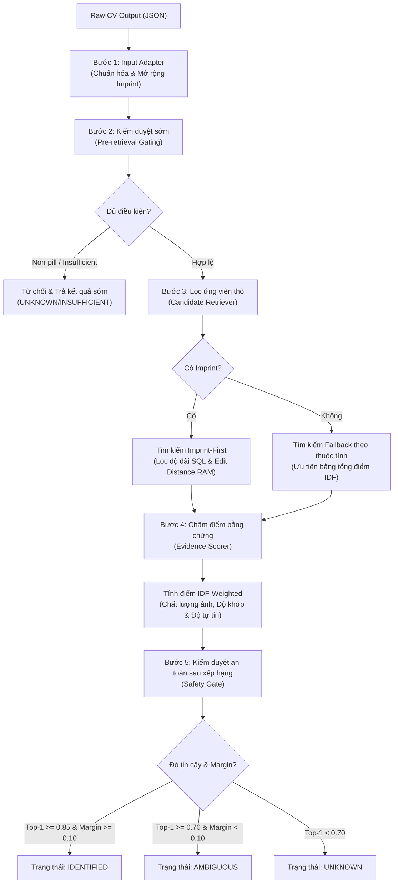

# Kiến trúc Pipeline RAG Drug Retrieval

## Mô tả chi tiết Pipeline RAG Retrieval

Kiến trúc xử lý của Pipeline RAG Drug Retrieval hoạt động qua các tầng lọc nâng cấp đảm bảo hiệu năng và tính an toàn cao:
1. **Tầng Adapter (Dữ liệu đầu vào)**: Nhận kết quả JSON thô từ mô hình Computer Vision, chuẩn hóa định dạng văn bản imprint và sinh biến thể chữ khắc OCR có confusable characters để mở rộng khả năng khớp.
2. **Tầng Gating Trước truy vấn**: Ngăn chặn chạy tốn tài nguyên hệ thống nếu ảnh quá kém hoặc vật thể chụp được không phải là thuốc.
3. **Tầng Candidate Retrieval (SQL & RAM Hybrid)**: Tận dụng cơ sở dữ liệu để lọc nhanh theo độ dài của chữ khắc bằng hàm SQL `func.length` để tránh tải thừa dữ liệu lên RAM, kết hợp thuật toán so khớp khoảng cách chỉnh sửa OCR có phạt lỗi confusable ký tự. Trong trường hợp không có imprint, tầng này tự động chuyển đổi sang chấm điểm ưu tiên ứng viên fallback theo tổng điểm IDF thuộc tính thay thế cho thang điểm tĩnh.
4. **Tầng Evidence Scorer (Chấm điểm IDF-Weighted)**: Tính toán điểm thành phần của các thuộc tính (Màu, Hình dạng, Vạch chia, Dạng bào chế...) bằng cách kết hợp: Trọng số độ hiếm IDF, Độ tự tin của mô hình CV, Độ trùng khớp đặc trưng, và Bộ nhân suy giảm do yếu tố nhiễu môi trường chụp (lóa sáng, bóng mờ).
5. **Tầng Safety Gate (Định danh an toàn)**: Phân tích chênh lệch điểm số margin để phân loại trạng thái định danh, ngăn ngừa tuyệt đối việc nhận diện nhầm khi có hai thuốc ngoại hình gần như giống hệt nhau.

---

## 1. Cách hệ thống hoạt động (Luồng xử lý 5 bước)
Hệ thống hoạt động như một dây chuyền lọc và kiểm duyệt an toàn qua 5 bước liên tiếp:

Bước 1: Chuẩn hóa dữ liệu đầu vào (Adapter)
Dữ liệu thô từ mô hình Computer Vision (CV) được chuẩn hóa về định dạng nội bộ RecognitionInput:

Chuẩn hóa viết hoa, loại bỏ khoảng trắng thừa và ký tự đặc biệt của chữ khắc (ví dụ: "A O1" hoặc "A;01" $\rightarrow$ "A01").
Sinh ra thêm tối đa 5 biến thể OCR dựa trên các cặp ký tự dễ nhầm lẫn (như O <-> 0, I <-> 1, S <-> 5) kèm hệ số phạt điểm giảm dần (Ví dụ biến thể cấp 1 nhân 0.85, biến thể cấp 2 nhân 0.65).
Bước 2: Kiểm duyệt sớm (Pre-retrieval Gating)
Bộ duyệt an toàn (SafetyGate) kiểm tra ảnh trước khi truy vấn cơ sở dữ liệu:

Nếu phát hiện vật thể không phải thuốc (possible_non_pill = True) $\rightarrow$ Dừng ngay và trả trạng thái UNKNOWN.
Nếu chất lượng ảnh quá tệ (cv_status = "insufficient_visual_evidence") $\rightarrow$ Dừng ngay và trả trạng thái INSUFFICIENT_EVIDENCE.
Bước 3: Tìm kiếm ứng viên (Candidate Retrieval)
Trường hợp có chữ khắc (Imprint-First): Hệ thống tính toán độ dài an toàn tối thiểu/tối đa của imprint. Sau đó, thực hiện câu truy vấn SQL lọc độ dài bằng hàm func.length của cơ sở dữ liệu. Bước lọc này loại bỏ nhanh hơn 80% các viên thuốc quá ngắn hoặc quá dài trước khi nạp ứng viên lên bộ nhớ RAM để tính khoảng cách sửa lỗi (weighted_edit_similarity).
Trường hợp không có chữ khắc (Fallback): Hệ thống lọc theo dạng bào chế, hình dạng, màu sắc và sắp xếp thứ tự ưu tiên bằng tổng trọng số IDF của các thuộc tính khớp.
Bước 4: Chấm điểm bằng chứng (Evidence Scoring)
Hệ thống lấy danh sách ứng viên rút gọn và bắt đầu đối chiếu chi tiết từng thuộc tính (Chữ khắc, hình dạng, màu sắc chính/phụ, vạch chia, logo) với đặc trưng của ứng viên trong DB để tính điểm.

Bước 5: Kiểm duyệt an toàn sau xếp hạng (Safety Gate Decision)
Sau khi sắp xếp các ứng viên theo điểm số từ cao xuống thấp:

Hệ thống so sánh ứng viên Top-1 và Top-2.
Để định danh chắc chắn (IDENTIFIED), hệ thống yêu cầu: Điểm Top-1 $\ge 0.85$, điểm khớp imprint $\ge 0.70$, không có mâu thuẫn cứng, và khoảng chênh lệch điểm số giữa Top-1 và Top-2 phải lớn hơn hoặc bằng 0.10 (margin >= 0.10). Nếu hai thuốc quá giống nhau (margin < 0.10), hệ thống sẽ trả về AMBIGUOUS (Mơ hồ) chứ không chọn bừa.
2. Cách tính điểm chi tiết (Scoring Math)
Điểm số của một ứng viên thuốc được tính toán dựa trên thông tin động (IDF) và chất lượng của ảnh chụp.

2.1. Trọng số IDF (Độ hiếm của đặc trưng)
Hệ thống thống kê tần suất xuất hiện của mọi giá trị thuộc tính trong toàn bộ database ($N$ là tổng số mẫu thuốc, $df$ là số mẫu chứa giá trị đó): $$IDF = \log\left(\frac{N + 1}{df + 1}\right) + 1$$

Ví dụ:
Màu trắng (WHITE) có mặt ở 90% viên thuốc $\rightarrow$ $df$ rất lớn $\rightarrow$ IDF thấp ($\approx 0.2$).
Chữ khắc TV5056 chỉ có ở 1 viên duy nhất $\rightarrow$ $df = 1$ $\rightarrow$ IDF tối đa ($1.0$).
Ý nghĩa: Giúp chữ khắc độc bản hoặc các màu sắc/hình dạng hiếm có tiếng nói quyết định hơn là các thuộc tính phổ thông.
2.2. Điểm bằng chứng từng trường (Field Evidence Score)
Với mỗi thuộc tính (ví dụ màu sắc), điểm đóng góp thực tế được tính bằng tích: $$\text{Evidence Score} = IDF \times \text{Match Score} \times \text{Confidence} \times \text{Quality Multiplier}$$

Trong đó:

Match Score (Độ khớp):
Khớp hoàn toàn = 1.0.
Lệch nhẹ (nhóm hình dạng Oval và Oblong) = 0.7.
Nếu là màu sắc phụ, điểm khớp = 0.7 * khớp màu chính + 0.3 * khớp màu phụ.
Lệch hoàn toàn = 0.0. (Riêng logo hoặc vạch chia mâu thuẫn nhưng độ tin cậy CV thấp thì được cứu về 0.5).
Confidence (Độ tự tin): Hệ số tin cậy do AI thị giác trả về (từ 0.0 đến 1.0).
Quality Multiplier (Bộ nhân chất lượng ảnh): Điểm của thuộc tính bị chiết khấu nếu chất lượng ảnh kém:
Ảnh bị lóa sáng (glare_detected): nhân 0.7
Cảnh báo ánh sáng kém (lighting_warning): nhân 0.5
Nhiễu sáng nhẹ (minor_glare): nhân 0.85
2.3. Điểm cuối cùng (Final Score)
Điểm số cuối cùng là tỷ lệ giữa bằng chứng thu thập được và bằng chứng lý thuyết tối đa có thể đạt được: $$\text{Final Score} = \frac{\sum \text{Evidence Score}}{\sum \text{Max Possible Score}}$$ $$\text{Max Possible Score} = IDF \times \text{Confidence} \times \text{Quality Multiplier}$$

Ý nghĩa: Việc chia cho mẫu số Max Possible Score giúp hệ thống công bằng đối với các trường hợp bị thiếu thông tin hoặc ảnh bị lóa (không phạt oan điểm của ứng viên đúng).
2.4. Cơ chế Bác bỏ cứng (Hard Reject)
Nếu dạng bào chế quan sát được từ CV mâu thuẫn hoàn toàn với database (ví dụ: CV dự đoán là viên nang CAPSULE nhưng database ghi nhận là viên nén TABLET) với độ tự tin cực cao ($\ge 0.95$), ứng viên đó sẽ bị đánh dấu hard_reject = True và lập tức bị loại bỏ khỏi danh sách định danh an toàn.

---
giải thích cth:\
Bước 1: Tính toán IDF thô (Raw IDF)
Với mỗi giá trị cụ thể của một thuộc tính (Ví dụ: Màu sắc là GREEN hoặc Hình dạng là ROUND), hệ thống tính chỉ số IDF thô bằng công thức:

$$\text{rawidf} = \log\left(\frac{N + 1}{\text{count} + 1}\right) + 1$$

Trong đó:

$N$: Tổng số bản ghi viên thuốc đang hoạt động trong Database.
$\text{count}$: Số lượng viên thuốc thực tế trong DB chứa giá trị thuộc tính này.
Laplace Smoothing (phần cộng $+1$ trong phân số): Giúp tránh lỗi chia cho 0 nếu thuộc tính chưa có sẵn trong DB.
Logarit ($\log$): Làm mượt sự tăng trưởng điểm số (không tăng tuyến tính quá dốc).
Phần cộng $+1$ ngoài cùng: Đảm bảo điểm số IDF tối thiểu luôn là $1.0$ (khi thuộc tính xuất hiện ở 100% số thuốc trong DB).
Bước 2: Chuẩn hóa Min-Max (Min-Max Normalization)
Do các trường dữ liệu có sự phân bổ khác nhau (ví dụ: hình dáng chỉ có $\approx 10$ loại nhưng imprint chữ khắc có thể có hàng nghìn loại), hệ thống cần đưa tất cả điểm IDF về cùng một thang đo $[0, 1]$:

$$\text{normalized} = \frac{\text{rawidf} - \text{minidf}}{\text{maxidf} - \text{minidf}}$$

$\text{maxidf}$: Điểm IDF của giá trị hiếm nhất trong nhóm thuộc tính đó.
$\text{minidf}$: Điểm IDF của giá trị phổ biến nhất trong nhóm thuộc tính đó.
Lưu ý: Nếu một thuộc tính chỉ chứa duy nhất một giá trị (ví dụ: toàn bộ DB chỉ có thị trường market là US), hệ thống gán mặc định $\text{normalized} = 0.2$ để thuộc tính đó không mang tính quyết định.
Bước 3: Áp dụng hệ số sàn (Floor Scaling)
Để tránh việc các thuộc tính quá phổ biến (như màu trắng WHITE) bị chuẩn hóa về $0.0$ (khiến nó mất hoàn toàn tác dụng chấm điểm hỗ trợ), hệ thống nén khoảng điểm từ $[0.0, 1.0]$ thành $[0.2, 1.0]$:

$$\text{idfweight} = 0.2 + 0.8 \times \text{normalized}$$

Như vậy:

Thuộc tính hiếm nhất trong DB sẽ có trọng số bằng $1.0$.
Thuộc tính phổ biến nhất trong DB sẽ có trọng số bằng $0.2$.
💡 Ví dụ trực quan bằng con số
Giả sử Database của bạn đang có tổng cộng $N = 35$ viên thuốc đang hoạt động:

Có $18$ viên màu WHITE ($\text{count} = 18$).
Chỉ có $1$ viên màu GREEN ($\text{count} = 1$).
1. Tính toán cho màu trắng (WHITE):
$$\text{rawidf}(\text{WHITE}) = \log\left(\frac{35 + 1}{18 + 1}\right) + 1 = \log\left(\frac{36}{19}\right) + 1 \approx 0.63 + 1 = 1.63$$

2. Tính toán cho màu xanh lục (GREEN):
$$\text{rawidf}(\text{GREEN}) = \log\left(\frac{35 + 1}{1 + 1}\right) + 1 = \log\left(\frac{36}{2}\right) + 1 = \log(18) + 1 \approx 2.89 + 1 = 3.89$$

3. Chuẩn hóa & Áp dụng hệ số sàn:
Giả định trong nhóm màu sắc, $\text{minidf} = 1.63$ (màu trắng) và $\text{maxidf} = 3.89$ (màu xanh lục).
Màu trắng (WHITE): $$\text{normalized} = \frac{1.63 - 1.63}{3.89 - 1.63} = 0.0$$ $$\text{idfweight}(\text{WHITE}) = 0.2 + 0.8 \times 0.0 = \mathbf{0.2}$$
Màu xanh lục (GREEN): $$\text{normalized} = \frac{3.89 - 1.63}{3.89 - 1.63} = 1.0$$ $$\text{idfweight}(\text{GREEN}) = 0.2 + 0.8 \times 1.0 = \mathbf{1.0}$$
Kết quả: Khi chấm điểm, nếu viên thuốc khớp màu GREEN (màu hiếm), nó đóng góp điểm số tối đa $1.0$ vào bằng chứng định danh. Nếu nó khớp màu WHITE (màu phổ biến), nó chỉ đóng góp một lượng nhỏ $0.2$, giúp ngăn ngừa việc định danh sai lệch do trùng màu sắc phổ thông.